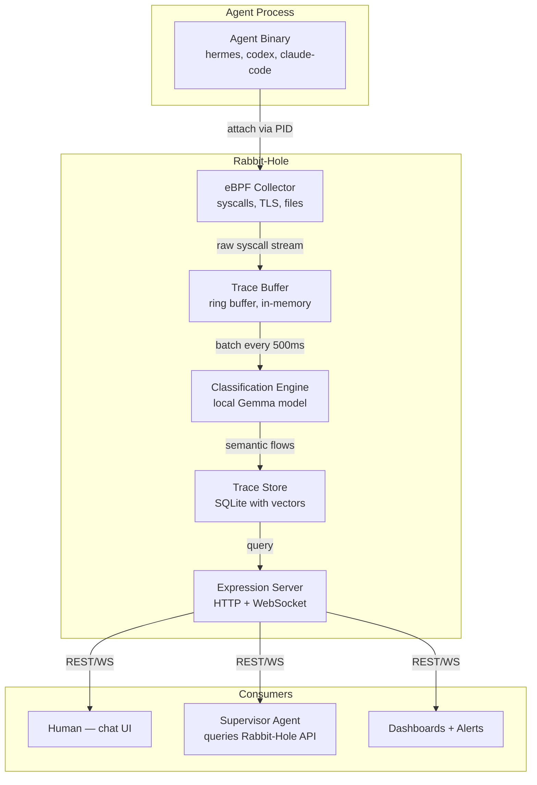
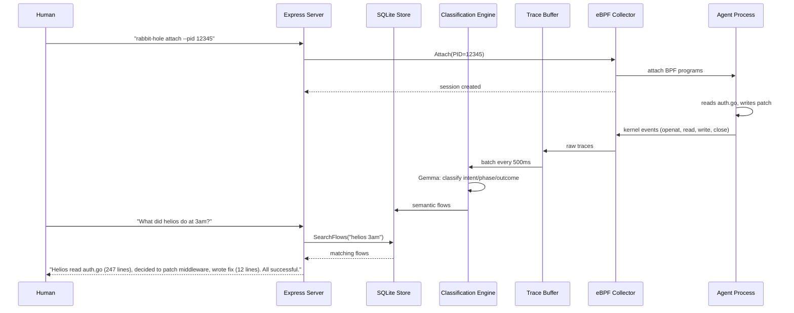

# S01 — Rabbit-Hole: Overview & Architecture

> **Go down the rabbit hole into your agent's decisions.**
> A legibility layer between agents and humans.

## 1. Overview

Rabbit-Hole is a **single Go binary** that attaches to agent processes and makes their decision-making legible. It has three layers:

```
┌─────────────────────────────────────────────┐
│               EXPRESS (Chat)                 │
│  "What did helios do at 3am?"               │
│  Natural language → context windows          │
├─────────────────────────────────────────────┤
│              CLASSIFY (Gemma)                │
│  Raw syscalls → semantic flows               │
│  "read auth.go → decided to patch → wrote"  │
├─────────────────────────────────────────────┤
│              COLLECT (eBPF)                  │
│  Every syscall, network call, file op        │
│  Zero SDK. Works with closed-source agents.  │
└─────────────────────────────────────────────┘
```

**Core principle:** The kernel saw everything. The agent cannot lie about what it did.

## 2. System Architecture



## 3. Core Entities

### 3.1 Trace

A single kernel-level event captured by eBPF.

```go
type Trace struct {
    ID          string       // UUIDv7
    PID         int32        // agent process ID
    Timestamp   time.Time    // kernel timestamp, ns precision
    Category    TraceCategory // syscall, network, file, llm_call, context_window
    Syscall     string       // "openat", "read", "write", "connect"
    Args        []string     // syscall arguments (sanitized)
    ReturnValue int64        // syscall return value
    Duration    time.Duration // wall-clock duration
    Stack       []Frame      // kernel stack trace at call site
    Errno       int32        // errno if failed (0 = success)
}

type TraceCategory string

const (
    TraceCategorySyscall       TraceCategory = "syscall"
    TraceCategoryNetwork       TraceCategory = "network"
    TraceCategoryFile          TraceCategory = "file"
    TraceCategoryLLMCall       TraceCategory = "llm_call"
    TraceCategoryContextWindow TraceCategory = "context_window"
    TraceCategoryProcess       TraceCategory = "process"
    TraceCategoryResource      TraceCategory = "resource"
)
```

### 3.2 Flow

A semantic unit — multiple traces grouped by the classifier into a meaningful action.

```go
type Flow struct {
    ID          string       // UUIDv7
    SessionID   string       // agent session this belongs to
    TraceIDs    []string     // constituent trace IDs
    Intent      string       // "read_file", "patch_code", "search_web", "llm_api_call"
    Phase       FlowPhase    // observation, deliberation, action, verification
    Description string       // human-readable: "Read auth.go (247 lines, 2ms)"
    Outcome     FlowOutcome  // success, failure, timeout, unknown
    Confidence  float64      // 0.0–1.0 classifier confidence
    StartTime   time.Time    // first trace timestamp
    EndTime     time.Time    // last trace timestamp
    Duration    time.Duration
    ContextWindow *ContextWindow // optional snapshot at decision point
    Metadata    json.RawMessage  // layer-specific metadata
}

type FlowPhase string

const (
    FlowPhaseObservation  FlowPhase = "observation"
    FlowPhaseDeliberation FlowPhase = "deliberation"
    FlowPhaseAction       FlowPhase = "action"
    FlowPhaseVerification FlowPhase = "verification"
)

type FlowOutcome string

const (
    FlowOutcomeSuccess FlowOutcome = "success"
    FlowOutcomeFailure FlowOutcome = "failure"
    FlowOutcomeTimeout FlowOutcome = "timeout"
    FlowOutcomeUnknown FlowOutcome = "unknown"
)
```

### 3.3 ContextWindow

A snapshot of the agent's context at a decision point. **Optional — off by default because expensive.**

```go
type ContextWindow struct {
    FlowID      string    // parent flow
    Timestamp   time.Time
    ModelName   string    // "deepseek-v4-pro"
    PromptText  string    // full system prompt
    MessagesIn  string    // last N messages sent to model
    MessagesOut string    // model's response
    TokenCount  int64     // total tokens in window
    Duration    time.Duration // LLM API call duration
}
```

### 3.4 Session

Groups traces and flows under one agent session.

```go
type Session struct {
    ID          string        // UUIDv7
    AgentPID    int32         // monitored process ID
    AgentName   string        // "hermes", "codex", "claude-code"
    StartTime   time.Time
    EndTime     *time.Time    // nil if still running
    Status      SessionStatus // running, completed, crashed, killed
    Metadata    SessionMetadata
}

type SessionStatus string

const (
    SessionStatusRunning    SessionStatus = "running"
    SessionStatusCompleted  SessionStatus = "completed"
    SessionStatusCrashed    SessionStatus = "crashed"
    SessionStatusKilled     SessionStatus = "killed"
)

type SessionMetadata struct {
    CommandLine string            // full command line
    Environment map[string]string // sanitized env vars
    WorkDir     string
    BinaryPath  string
    Version     string            // agent version if detectable
}
```

## 4. Service Interfaces

### 4.1 Collector Service

```go
type Collector interface {
    // Attach starts collecting traces for a PID. Returns a session ID.
    Attach(ctx context.Context, pid int32, opts CollectOptions) (*Session, error)

    // Detach stops collecting for a session.
    Detach(ctx context.Context, sessionID string) error

    // List returns all active sessions.
    List(ctx context.Context) ([]Session, error)

    // Stream returns a channel of raw traces for a session.
    Stream(ctx context.Context, sessionID string) (<-chan Trace, error)

    // Health returns nil if the collector is healthy.
    Health(ctx context.Context) error
}

type CollectOptions struct {
    ContextWindows   bool     // capture context windows (expensive, off by default)
    TraceCategories  []TraceCategory // which categories to collect (all by default)
    BufferSize       int      // ring buffer size in traces (default: 100000)
    TLSInterception  bool     // intercept TLS for LLM API call detection
    ResourceSampling time.Duration // CPU/memory sampling interval (0 = off)
}
```

### 4.2 Classifier Service

```go
type Classifier interface {
    // Classify processes a batch of raw traces and produces semantic flows.
    Classify(ctx context.Context, sessionID string, traces []Trace) ([]Flow, error)

    // ClassifyStream continuously classifies from a trace channel.
    ClassifyStream(ctx context.Context, sessionID string, traces <-chan Trace) (<-chan Flow, error)

    // Health returns nil if the classifier is healthy (model loaded).
    Health(ctx context.Context) error

    // ModelInfo returns information about the loaded classification model.
    ModelInfo(ctx context.Context) (ModelInfo, error)
}

type ModelInfo struct {
    Name       string // "gemma-3-4b"
    Version    string
    LoadedAt   time.Time
    MemoryMB   int64
    DeviceType string // "cpu", "cuda", "npu"
}
```

### 4.3 Expression Service

```go
type ExpressionService interface {
    // Search queries flows using natural language or structured filters.
    Search(ctx context.Context, req SearchRequest) (*SearchResponse, error)

    // GetFlow retrieves a specific flow with full context.
    GetFlow(ctx context.Context, flowID string) (*Flow, error)

    // GetContextWindow retrieves a context window snapshot.
    GetContextWindow(ctx context.Context, flowID string) (*ContextWindow, error)

    // GetSession retrieves a session summary.
    GetSession(ctx context.Context, sessionID string) (*Session, error)

    // ListSessions returns recent sessions.
    ListSessions(ctx context.Context, opts ListOptions) ([]Session, error)

    // Subscribe opens a WebSocket for real-time flow events.
    Subscribe(ctx context.Context, sessionID string) (<-chan Flow, error)

    // Health returns nil if the expression server is healthy.
    Health(ctx context.Context) error

    // Chat processes a natural language query and returns results.
    Chat(ctx context.Context, req ChatRequest) (*ChatResponse, error)
}

type SearchRequest struct {
    Query       string        // natural language or structured
    SessionID   string        // filter to specific session
    TimeRange   TimeRange     // time window
    Categories  []FlowPhase   // filter by phase
    Outcomes    []FlowOutcome // filter by outcome
    Limit       int           // max results (default: 50)
    Cursor      string        // pagination cursor
    IncludeContextWindows bool
}

type ChatRequest struct {
    Message     string // natural language: "What did helios do at 3am?"
    SessionID   string // optional — scope to one session
}

type ChatResponse struct {
    Answer      string   // natural language response
    Flows       []Flow   // referenced flows
    Suggestions []string // follow-up questions
}
```

### 4.4 Storage Service

```go
type Storage interface {
    // Trace operations
    StoreTraces(ctx context.Context, traces []Trace) error
    QueryTraces(ctx context.Context, req TraceQuery) ([]Trace, error)

    // Flow operations
    StoreFlows(ctx context.Context, flows []Flow) error
    GetFlow(ctx context.Context, flowID string) (*Flow, error)
    QueryFlows(ctx context.Context, req FlowQuery) ([]Flow, string, error) // returns cursor

    // Session operations
    StoreSession(ctx context.Context, session *Session) error
    GetSession(ctx context.Context, sessionID string) (*Session, error)
    ListSessions(ctx context.Context, offset, limit int) ([]Session, error)
    UpdateSession(ctx context.Context, session *Session) error

    // Context window operations
    StoreContextWindow(ctx context.Context, cw *ContextWindow) error
    GetContextWindow(ctx context.Context, flowID string) (*ContextWindow, error)

    // Search
    SearchFlows(ctx context.Context, query string, limit int) ([]Flow, error)

    // Maintenance
    Compact(ctx context.Context, before time.Time) error
    Stats(ctx context.Context) (StorageStats, error)
    Health(ctx context.Context) error
}
```

## 5. Data Flow — Happy Path



## 6. Error Propagation

| Layer | Error | → Next Layer | → User Sees |
|-------|-------|-------------|------------|
| eBPF | attach fails (permission) | → Collector | `rabbit-hole: permission denied — run as root or grant CAP_BPF` |
| eBPF | ring buffer full | → Buffer | dropped traces logged, `dropped_traces` metric increments |
| Buffer | batch timeout during idle | → Classifier | empty batch — normal, no error |
| Classify | Gemma model not loaded | → Storage | flows stored with `confidence: 0, outcome: unknown` |
| Classify | OOM during classification | → Storage | partial batch stored, `classifier_oom` metric, process restarts Gemma |
| Storage | SQLite locked (WAL mode) | → Express | retry 3x with exponential backoff; on failure return 503 |
| Express | search timeout (30s) | → User | 504, partial results with `"truncated": true` |
| Express | context window not captured | → User | flow returns with `context_window: null` — normal when disabled |

## 7. Configuration

| Env Var | Type | Default | Description |
|---------|------|---------|-------------|
| `RABBITHOLE_DATA_DIR` | string | `~/.rabbit-hole/` | Data directory for SQLite, models, logs |
| `RABBITHOLE_MODEL_PATH` | string | `$DATA_DIR/models/gemma-3-4b.gguf` | Path to Gemma GGUF model |
| `RABBITHOLE_MODEL_NAME` | string | `gemma-3-4b` | Model identifier for model info |
| `RABBITHOLE_LISTEN_ADDR` | string | `127.0.0.1:9734` | HTTP/WS server bind address |
| `RABBITHOLE_BUFFER_SIZE` | int | `100000` | Ring buffer size in traces |
| `RABBITHOLE_BATCH_INTERVAL` | duration | `500ms` | Classification batch interval |
| `RABBITHOLE_CONTEXT_WINDOWS` | bool | `false` | Enable context window capture (expensive) |
| `RABBITHOLE_RETENTION_DAYS` | int | `30` | Auto-delete traces/flows older than N days |
| `RABBITHOLE_MAX_SESSIONS` | int | `50` | Maximum concurrent monitored sessions |
| `RABBITHOLE_LOG_LEVEL` | string | `info` | debug, info, warn, error |
| `RABBITHOLE_TLS_INTERCEPT` | bool | `true` | Enable TLS interception for LLM API detection |

## 8. Monorepo Layout

```
rabbit-hole/
├── cmd/
│   └── rabbit-hole/
│       └── main.go                  # entry point, wiring
├── internal/
│   ├── collector/
│   │   ├── ebpf.go                   # eBPF program loading + attachment
│   │   ├── tls.go                    # TLS interception (uprobes on SSL_read/SSL_write)
│   │   ├── buffer.go                 # ring buffer implementation
│   │   ├── collector.go              # Collector interface implementation
│   │   └── collector_test.go
│   ├── classify/
│   │   ├── engine.go                 # classification pipeline
│   │   ├── gemma.go                  # Gemma model loading + inference
│   │   ├── patterns.go               # classification pattern catalog
│   │   ├── classifier.go             # Classifier interface implementation
│   │   └── classifier_test.go
│   ├── express/
│   │   ├── server.go                 # HTTP server (net/http + gorilla/websocket)
│   │   ├── handlers.go               # REST + WS handlers
│   │   ├── chat.go                   # natural language query processing
│   │   ├── search.go                 # structured search
│   │   ├── middleware.go             # logging, auth, CORS
│   │   └── server_test.go
│   ├── storage/
│   │   ├── sqlite.go                 # SQLite store implementation
│   │   ├── migrations/               # SQL migration files
│   │   │   ├── 001_initial.up.sql
│   │   │   └── 001_initial.down.sql
│   │   ├── search.go                 # FTS5 + vector search
│   │   ├── compact.go                # retention + compaction
│   │   └── storage_test.go
│   ├── attach/
│   │   ├── attach.go                 # attach/detach orchestration
│   │   └── session.go               # session lifecycle management
│   └── config/
│       ├── config.go                 # env var parsing + validation
│       └── config_test.go
├── pkg/
│   └── types/
│       ├── trace.go                  # Trace, Flow, Session, ContextWindow types
│       ├── errors.go                 # typed errors
│       └── api.go                    # request/response types
├── specs/                            # this directory
├── web/                              # chat UI (optional, Phase 2)
│   └── index.html
├── Makefile
├── go.mod
├── go.sum
├── AGENTS.md
├── .gitignore
└── .coding-hermes/
    └── tasks.md
```

## 9. Failure Modes

| Failure | Manifestation | Detection | Recovery |
|---------|--------------|-----------|----------|
| eBPF not available (kernel < 5.8) | `rabbit-hole attach` fails with "eBPF not supported" | exit code 1, stderr message | user upgrades kernel or uses strace fallback |
| Permissions (no CAP_BPF) | attach fails | `EPERM` from bpf() syscall | user runs as root or grants capabilities |
| Gemma model not found | flows stored with confidence=0 | `classifier_confidence_zero` metric | user downloads model to RABBITHOLE_MODEL_PATH |
| OOM from too many sessions | process killed by OOM killer | systemd restarts, session data lost | reduce RABBITHOLE_MAX_SESSIONS |
| SQLite corruption | read/write errors | `SQLITE_CORRUPT` error codes | automatic backup restore or manual recovery |
| Disk full | storage writes fail | `SQLITE_FULL` error, 507 HTTP status | reduce retention, increase disk |
| Ring buffer overflow under load | oldest traces dropped | `dropped_traces` metric increments | increase RABBITHOLE_BUFFER_SIZE |

## 10. Testing Requirements

- **Collector:** Integration tests with a real process (not the test binary) — spawn `sleep 5`, attach eBPF, verify syscalls captured. Test attach/detach lifecycle. Test buffer overflow behavior.
- **Classifier:** Unit tests with recorded trace batches — verify classification output matches expected flows. Test confidence thresholds. Test OOM recovery.
- **Storage:** Integration tests with in-memory SQLite — CRUD for all types. Test WAL mode concurrent access. Test retention/compaction.
- **Express:** HTTP integration tests with httptest.Server — all endpoints. WebSocket subscription tests. Timeout behavior.
- **E2E:** `rabbit-hole attach --pid $(pgrep test-agent)` → verify flows appear in search. Full agent session lifecycle.
