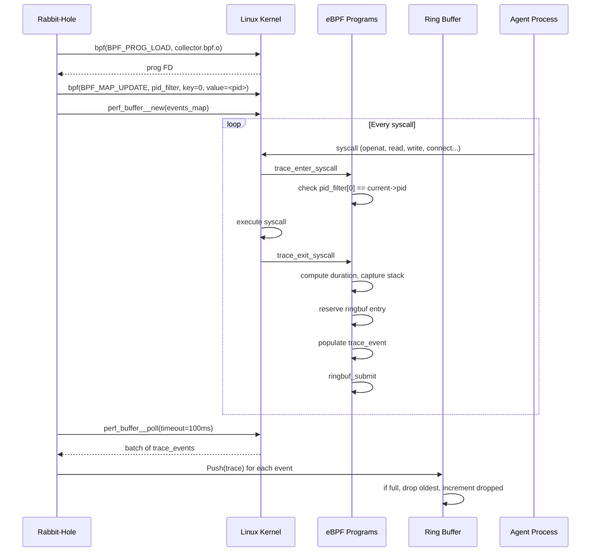

# S02 — Collection Layer

> **The kernel saw everything.** Zero SDK. Works with closed-source CLI agents. The agent can't lie about what it did.

## 1. Interfaces

```go
// collector.go

// Collector is the top-level interface for attaching to agent processes
// and receiving kernel-level telemetry.
type Collector interface {
    Attach(ctx context.Context, pid int32, opts CollectOptions) (*Session, error)
    Detach(ctx context.Context, sessionID string) error
    List(ctx context.Context) ([]Session, error)
    Stream(ctx context.Context, sessionID string) (<-chan Trace, error)
    Health(ctx context.Context) error
}

type CollectOptions struct {
    ContextWindows   bool
    TraceCategories  []TraceCategory
    BufferSize       int
    TLSInterception  bool
    ResourceSampling time.Duration
}
```

## 2. Implementation

### 2.1 eBPF Program Loading

```go
// ebpf.go

//go:generate bpf2go -cc clang -cflags "-O2 -g -Wall -Werror" -target amd64 bpf collector.bpf.c -- -I/usr/include/x86_64-linux-gnu

type eBPFCollector struct {
    objs       bpfObjects
    sessions   map[string]*collectionSession
    mu         sync.RWMutex
    ringBuffer *ringBuffer
}

type bpfObjects struct {
    // Syscall entry/exit probes
    TraceEnterSyscall *ebpf.Program `ebpf:"trace_enter_syscall"`
    TraceExitSyscall  *ebpf.Program `ebpf:"trace_exit_syscall"`

    // Network probes (connect, sendto, recvfrom)
    TraceConnect      *ebpf.Program `ebpf:"trace_connect"`
    TraceSendMsg      *ebpf.Program `ebpf:"trace_sendmsg"`
    TraceRecvMsg      *ebpf.Program `ebpf:"trace_recvmsg"`

    // File operation probes
    TraceOpenAt       *ebpf.Program `ebpf:"trace_openat"`
    TraceRead         *ebpf.Program `ebpf:"trace_read"`
    TraceWrite        *ebpf.Program `ebpf:"trace_write"`
    TraceClose        *ebpf.Program `ebpf:"trace_close"`

    // Process lifecycle
    TraceExec         *ebpf.Program `ebpf:"trace_exec"`
    TraceExit         *ebpf.Program `ebpf:"trace_exit"`
    TraceFork         *ebpf.Program `ebpf:"trace_fork"`

    // Perf event buffer for trace delivery
    Events            *ebpf.Map     `ebpf:"events"`
    FilterMap         *ebpf.Map     `ebpf:"pid_filter"`

    // TLS interception (uprobes on libssl/libcrypto)
    UprobeSSLRead     *ebpf.Program `ebpf:"uprobe_ssl_read"`
    UprobeSSLWrite    *ebpf.Program `ebpf:"uprobe_ssl_write"`
    UretprobeSSLRead  *ebpf.Program `ebpf:"uretprobe_ssl_read"`
    UretprobeSSLWrite *ebpf.Program `ebpf:"uretprobe_ssl_write"`
}

type collectionSession struct {
    pid       int32
    filterFD  int // PID filter map file descriptor
    attached  bool
    createdAt time.Time
}
```

### 2.2 Ring Buffer

```go
// buffer.go

type ringBuffer struct {
    buf     []Trace
    size    int
    head    int  // next write position
    tail    int  // next read position
    count   int  // current number of elements
    mu      sync.Mutex
    dropped atomic.Uint64
    cond    *sync.Cond // signals readers when data is available
}

func newRingBuffer(size int) *ringBuffer {
    rb := &ringBuffer{
        buf:  make([]Trace, size),
        size: size,
    }
    rb.cond = sync.NewCond(&rb.mu)
    return rb
}

// Push adds a trace. If full, oldest trace is dropped.
func (rb *ringBuffer) Push(t Trace) {
    rb.mu.Lock()
    defer rb.mu.Unlock()

    if rb.count == rb.size {
        // Buffer full — drop oldest
        rb.tail = (rb.tail + 1) % rb.size
        rb.dropped.Add(1)
    } else {
        rb.count++
    }

    rb.buf[rb.head] = t
    rb.head = (rb.head + 1) % rb.size
    rb.cond.Signal()
}

// Pop removes and returns the oldest trace. Blocks if empty.
func (rb *ringBuffer) Pop(ctx context.Context) (Trace, error) {
    rb.mu.Lock()
    defer rb.mu.Unlock()

    for rb.count == 0 {
        select {
        case <-ctx.Done():
            return Trace{}, ctx.Err()
        default:
        }
        rb.cond.Wait()
    }

    t := rb.buf[rb.tail]
    rb.tail = (rb.tail + 1) % rb.size
    rb.count--
    return t, nil
}

// PopBatch returns up to max traces without blocking.
func (rb *ringBuffer) PopBatch(max int) []Trace {
    rb.mu.Lock()
    defer rb.mu.Unlock()

    n := min(max, rb.count)
    batch := make([]Trace, n)
    for i := 0; i < n; i++ {
        batch[i] = rb.buf[rb.tail]
        rb.tail = (rb.tail + 1) % rb.size
    }
    rb.count -= n
    return batch
}

func (rb *ringBuffer) Stats() BufferStats {
    rb.mu.Lock()
    defer rb.mu.Unlock()
    return BufferStats{
        Size:    rb.size,
        Used:    rb.count,
        Dropped: rb.dropped.Load(),
    }
}
```

### 2.3 Attach/Detach

```go
// attach.go

func (c *eBPFCollector) Attach(ctx context.Context, pid int32, opts CollectOptions) (*Session, error) {
    c.mu.Lock()
    defer c.mu.Unlock()

    // Check max sessions
    if len(c.sessions) >= c.maxSessions {
        return nil, ErrMaxSessionsReached{Max: c.maxSessions}
    }

    // Verify process exists
    if !processExists(pid) {
        return nil, ErrProcessNotFound{PID: pid}
    }

    sessionID := uuid.Must(uuid.NewV7()).String()
    session := &Session{
        ID:        sessionID,
        AgentPID:  pid,
        AgentName: detectAgentName(pid),
        StartTime: time.Now(),
        Status:    SessionStatusRunning,
        Metadata: SessionMetadata{
            CommandLine: readCmdline(pid),
            WorkDir:     readCwd(pid),
            BinaryPath:  readExe(pid),
        },
    }

    // Add PID to eBPF filter map (so we only trace this process)
    key := uint32(0)
    if err := c.objs.FilterMap.Put(&key, &pid); err != nil {
        return nil, fmt.Errorf("ebpf: add PID to filter: %w", err)
    }

    // Attach TLS interception if requested
    if opts.TLSInterception {
        if err := c.attachTLSProbes(pid); err != nil {
            return nil, fmt.Errorf("ebpf: attach TLS probes: %w", err)
        }
    }

    cs := &collectionSession{
        pid:       pid,
        attached:  true,
        createdAt: time.Now(),
    }
    c.sessions[sessionID] = cs

    return session, nil
}

func (c *eBPFCollector) Detach(ctx context.Context, sessionID string) error {
    c.mu.Lock()
    defer c.mu.Unlock()

    cs, ok := c.sessions[sessionID]
    if !ok {
        return ErrSessionNotFound{SessionID: sessionID}
    }

    // Remove PID from eBPF filter map
    if err := c.objs.FilterMap.Delete(uint32(0)); err != nil {
        // non-fatal — filter map key may already be cleared
        slog.Warn("ebpf: failed to clear PID filter", "err", err)
    }

    // Detach TLS probes
    c.detachTLSProbes(cs.pid)

    cs.attached = false
    delete(c.sessions, sessionID)
    return nil
}
```

## 3. Error Handling

| Error | Condition | Caller Action |
|-------|-----------|--------------|
| `ErrMaxSessionsReached` | `len(sessions) >= maxSessions` | Return to user: "max sessions reached. Detach an existing session or increase RABBITHOLE_MAX_SESSIONS" |
| `ErrProcessNotFound` | `/proc/<pid>` does not exist | Return to user: "process PID not found" |
| `ErrPermissionDenied` | `bpf()` returns `EPERM` | Return to user: "permission denied — run as root or grant CAP_BPF, CAP_SYS_ADMIN" |
| `ErrKernelTooOld` | kernel < 5.8, BTF not available | Return to user: "kernel too old — eBPF requires Linux 5.8+ (CO-RE)" |
| `ErrRingBufferOverflow` | ring buffer full, `dropped` > 0 | Non-blocking. Log warning. Increment metric. |
| `ErrTLSNotAvailable` | libssl/libcrypto not loaded by process | Log warning. Continue without TLS interception. |
| `ErrSessionNotFound` | `Detach` or `Stream` with unknown ID | Return 404 to caller. |

### Error Types

```go
// errors.go

type ErrMaxSessionsReached struct{ Max int }
func (e ErrMaxSessionsReached) Error() string {
    return fmt.Sprintf("max sessions (%d) reached", e.Max)
}

type ErrProcessNotFound struct{ PID int32 }
func (e ErrProcessNotFound) Error() string {
    return fmt.Sprintf("process %d not found", e.PID)
}

type ErrSessionNotFound struct{ SessionID string }
func (e ErrSessionNotFound) Error() string {
    return fmt.Sprintf("session %s not found", e.SessionID)
}

type ErrPermissionDenied struct{ Detail string }
func (e ErrPermissionDenied) Error() string {
    return fmt.Sprintf("permission denied: %s", e.Detail)
}

type ErrKernelTooOld struct{ Required, Actual string }
func (e ErrKernelTooOld) Error() string {
    return fmt.Sprintf("kernel too old: requires %s, have %s", e.Required, e.Actual)
}
```

## 4. Edge Cases

| Edge Case | Behavior |
|-----------|----------|
| Process exits while attached | eBPF programs auto-detach on process exit. Collector receives `trace_exit` event, marks session as `crashed` or `completed`. |
| Process forks/clones children | By default, trace only the target PID (not children). Configurable via `CollectOptions.FollowChildren`. |
| Ring buffer overflow (10x normal rate) | Drop oldest traces. Increment `dropped` counter. Log rate-limited warning (1/sec max). |
| eBPF map full (events map at max entries) | Kernel drops events. `perf_buffer_poll` returns fewer events than expected. Log `ebpf_map_full` metric. |
| TLS library not loaded at attach time | Attach succeeds. Uprobes fail silently. `tls_available` metric stays at 0. |
| TLS library loaded after attach | Uprobes fire retroactively when library is dlopen'd. Works with `bpf_uprobe_multi`. |
| Agent binary is statically linked (no libssl) | TLS interception unavailable. LLM calls must be detected via `/proc/net/tcp` connection heuristics. |
| Context windows enabled + high-frequency agent (100+ LLM calls/min) | Ring buffer fills. Context windows become partial (truncated at buffer boundary). |
| Multiple collectors on same PID | Not allowed. `Attach` returns `ErrAlreadyAttached`. |

## 5. Dependencies

```go
// Imports
import (
    "github.com/cilium/ebpf"          // eBPF library
    "github.com/cilium/ebpf/link"     // attach/detach programs
    "github.com/cilium/ebpf/perf"     // perf event reading
    "github.com/cilium/ebpf/rlimit"   // remove memlock rlimit
    "github.com/google/uuid"          // session IDs
    "golang.org/x/sys/unix"           // syscall wrappers
)
```

**Injected:**
- `log/slog.Logger` — structured logging
- `prometheus.Registerer` — metrics (optional)

**Injected into:**
- Classification Engine (via `Stream` channel)
- Storage Layer (via batch writes)

## 6. Configuration

| Env Var | Type | Default | Description |
|---------|------|---------|-------------|
| `RABBITHOLE_BUFFER_SIZE` | int | 100000 | Ring buffer capacity in traces |
| `RABBITHOLE_MAX_SESSIONS` | int | 50 | Maximum concurrent monitored sessions |
| `RABBITHOLE_TLS_INTERCEPT` | bool | true | Enable TLS interception |
| `RABBITHOLE_BPF_DEBUG` | bool | false | Enable BPF verifier logging |

## 7. eBPF Program (C — collector.bpf.c)

```c
// collector.bpf.c — eBPF programs for syscall tracing

#include <linux/bpf.h>
#include <bpf/bpf_helpers.h>
#include <bpf/bpf_tracing.h>
#include <bpf/bpf_core_read.h>

#define MAX_ARGS 6
#define MAX_FILENAME 256
#define MAX_STACK_DEPTH 32

// Event type pushed to perf buffer
struct trace_event {
    __u64 timestamp_ns;
    __u32 pid;
    __u32 tid;
    __u64 syscall_nr;
    __u64 args[MAX_ARGS];
    __s64 ret;
    __u32 errno_val;
    __u64 duration_ns;
    __u32 stack_depth;
    __u64 stack[MAX_STACK_DEPTH];
    __u8 category;  // TraceCategory enum
    char comm[16];
    // File-specific
    char filename[MAX_FILENAME];
    // Network-specific
    __u32 saddr;
    __u32 daddr;
    __u16 sport;
    __u16 dport;
};

struct {
    __uint(type, BPF_MAP_TYPE_HASH);
    __uint(max_entries, 1);
    __type(key, __u32);
    __type(value, __u32);  // target PID
} pid_filter SEC(".maps");

struct {
    __uint(type, BPF_MAP_TYPE_PERF_EVENT_ARRAY);
    __uint(key_size, sizeof(__u32));
    __uint(value_size, sizeof(__u32));
} events SEC(".maps");

struct {
    __uint(type, BPF_MAP_TYPE_HASH);
    __uint(max_entries, 10240);
    __type(key, __u64);   // syscall_nr << 32 | tid
    __type(value, __u64); // entry timestamp
} syscall_start SEC(".maps");

// Check if this PID should be traced
static __always_inline int should_trace(__u32 pid) {
    __u32 key = 0;
    __u32 *target = bpf_map_lookup_elem(&pid_filter, (void *)&key);
    if (!target) return 0;
    return (*target == pid) ? 1 : 0;
}

SEC("tracepoint/raw_syscalls/sys_enter")
int trace_enter_syscall(struct trace_event_raw_sys_enter *ctx) {
    __u32 pid = bpf_get_current_pid_tgid() >> 32;
    if (!should_trace(pid)) return 0;

    __u64 tid = bpf_get_current_pid_tgid();
    __u64 entry_key = ((__u64)ctx->id << 32) | (__u32)tid;
    __u64 timestamp = bpf_ktime_get_ns();
    bpf_map_update_elem(&syscall_start, &entry_key, &timestamp, BPF_ANY);
    return 0;
}

SEC("tracepoint/raw_syscalls/sys_exit")
int trace_exit_syscall(struct trace_event_raw_sys_exit *ctx) {
    __u32 pid = bpf_get_current_pid_tgid() >> 32;
    if (!should_trace(pid)) return 0;

    __u64 tid = bpf_get_current_pid_tgid();
    __u64 entry_key = ((__u64)ctx->id << 32) | (__u32)tid;

    __u64 *start_ns = bpf_map_lookup_elem(&syscall_start, &entry_key);
    if (!start_ns) return 0;

    struct trace_event *event;
    event = bpf_ringbuf_reserve(&events, sizeof(*event), 0);
    if (!event) return 0;

    event->timestamp_ns = bpf_ktime_get_ns();
    event->pid = pid;
    event->tid = (__u32)tid;
    event->syscall_nr = ctx->id;
    event->ret = ctx->ret;
    event->errno_val = (ctx->ret < 0) ? -ctx->ret : 0;
    event->duration_ns = event->timestamp_ns - *start_ns;
    event->stack_depth = bpf_get_stackid(ctx, &events, BPF_F_USER_STACK);
    event->category = 0; // TRACE_CATEGORY_SYSCALL
    bpf_get_current_comm(&event->comm, sizeof(event->comm));

    bpf_ringbuf_submit(event, 0);
    bpf_map_delete_elem(&syscall_start, &entry_key);
    return 0;
}

char LICENSE[] SEC("license") = "GPL";
```

## 8. Testing

### Unit Tests
- Ring buffer: push/pop ordering, overflow drop behavior, concurrent push/pop, stats accuracy
- PID filter: map insertion, lookup, deletion
- Session lifecycle: attach → list → detach → verify cleanup

### Integration Tests
- Attach to a real process (`sleep 5`, `cat /dev/null`)
- Verify syscall events arrive via ring buffer
- Verify attach to non-existent PID returns `ErrProcessNotFound`
- Verify double-attach to same PID returns error
- Verify detach stops event flow
- Verify process exit auto-detaches and marks session status
- Verify TLS interception captures HTTPS reads/writes from a Go process using net/http

### Stress Tests
- Attach to process doing 100K syscalls/sec → verify ring buffer doesn't OOM
- Attach/detach 100 sessions sequentially → verify no memory leak
- Run 10 concurrent sessions → verify filter map isolation

## 9. Failure Modes

| Failure | Manifestation | Recovery |
|---------|--------------|----------|
| eBPF verifier rejects program | `Attach` returns error with verifier log | Check kernel version. Recompile with correct `-target`. |
| Ring buffer read slower than write | `dropped` counter increases | Increase `RABBITHOLE_BUFFER_SIZE` or reduce `RABBITHOLE_MAX_SESSIONS`. |
| Process execs a new binary (re-exec) | eBPF programs remain attached because they're on the kernel task_struct, not the binary. New binary starts generating different syscall patterns. | Session continues normally. Re-exec detected via `trace_exec` event. |
| Kernel runs out of BPF memory | `bpf()` syscall returns `ENOMEM` | Hard failure. `Attach` returns error. Restart rabbit-hole daemon. |
| eBPF program unloaded while session active | perf reader returns `EINVAL` | Collector detects error, marks session as crashed, cleans up. |

## 10. Diagram — Collection Data Flow



> Next: S03 — Classification Layer
