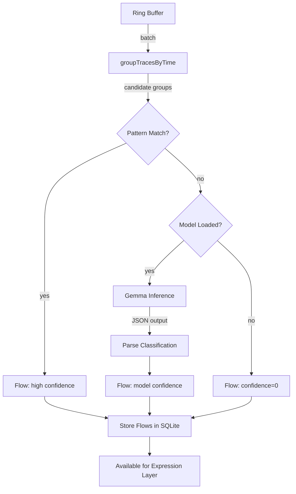

# S03 — Classification Layer

> **Raw syscalls → semantic understanding.** Pluggable classification backends: local Gemma for edge/air-gapped, remote gRPC for fleet/centralized. Nobody else does this.

## 1. Interfaces

```go
// classifier.go

// ClassificationBackend is the pluggable model that turns trace groups into flows.
// Two implementations: LocalBackend (Gemma on-device) and RemoteBackend (gRPC to central).
type ClassificationBackend interface {
    Classify(ctx context.Context, groups [][]Trace) ([]Flow, error)
    Health(ctx context.Context) error
    Info(ctx context.Context) (ModelInfo, error)
    Close() error
}

type ModelInfo struct {
    Name       string // "gemma-3-4b" or "remote:v2"
    Version    string
    Kind       string // "local" or "remote"
    Ready      bool
    LoadedAt   *time.Time // nil for remote
    MemoryMB   int64      // 0 for remote
    DeviceType string     // "cpu", "cuda", "npu", "remote"
    Endpoint   string     // gRPC address (remote only)
    Latency    time.Duration // last ping round-trip
}
```

## 2. Backend Implementations

### 2.1 LocalBackend — Gemma on-device

```go
// local.go

type LocalBackend struct {
    modelPath string
    modelName string
    loaded    atomic.Bool
    loadedAt  time.Time
    mu        sync.RWMutex
    ctx       unsafe.Pointer // llama_context*
    params    unsafe.Pointer // llama_model_params*
    totalInferences atomic.Int64
    totalTokens     atomic.Int64
}

func NewLocalBackend(modelPath, modelName string) *LocalBackend {
    return &LocalBackend{modelPath: modelPath, modelName: modelName}
}

func (b *LocalBackend) Classify(ctx context.Context, groups [][]Trace) ([]Flow, error) { ... }
func (b *LocalBackend) Health(ctx context.Context) error { ... }
func (b *LocalBackend) Info(ctx context.Context) (ModelInfo, error) { ... }
func (b *LocalBackend) Close() error { ... }
```

### 2.2 RemoteBackend — gRPC to Central Classifier

```go
// remote.go

type RemoteBackend struct {
    endpoint string
    conn     *grpc.ClientConn
    client   pb.ClassifierClient
    token    string // auth token for central service
    mu       sync.RWMutex
    lastPing time.Duration
}

func NewRemoteBackend(endpoint, token string) (*RemoteBackend, error) {
    conn, err := grpc.Dial(endpoint,
        grpc.WithTransportCredentials(insecure.NewCredentials()), // or TLS
        grpc.WithBlock(),
        grpc.WithTimeout(5*time.Second),
    )
    if err != nil {
        return nil, fmt.Errorf("connect to classifier at %s: %w", endpoint, err)
    }
    return &RemoteBackend{
        endpoint: endpoint,
        conn:     conn,
        client:   pb.NewClassifierClient(conn),
        token:    token,
    }, nil
}

func (b *RemoteBackend) Classify(ctx context.Context, groups [][]Trace) ([]Flow, error) {
    req := &pb.ClassifyRequest{Groups: marshalGroups(groups)}
    resp, err := b.client.Classify(ctx, req)
    if err != nil {
        return nil, fmt.Errorf("remote classify: %w", err)
    }
    return unmarshalFlows(resp.Flows), nil
}

func (b *RemoteBackend) Health(ctx context.Context) error {
    start := time.Now()
    _, err := b.client.Ping(ctx, &pb.PingRequest{})
    b.lastPing = time.Since(start)
    return err
}

func (b *RemoteBackend) Info(ctx context.Context) (ModelInfo, error) {
    resp, err := b.client.Info(ctx, &pb.InfoRequest{})
    if err != nil {
        return ModelInfo{}, err
    }
    return ModelInfo{
        Name: resp.Name, Version: resp.Version,
        Kind: "remote", Ready: true, Endpoint: b.endpoint,
        Latency: b.lastPing,
    }, nil
}
```

### 2.3 Classification Engine (unchanged from original — dispatches to backend)

```go
// engine.go

type ClassificationEngine struct {
    backend     ClassificationBackend // ← pluggable
    store       Storage
    patterns    *PatternCatalog
    batchSize   int
    batchTimeout time.Duration
    logger      *slog.Logger
}

func NewClassificationEngine(backend ClassificationBackend, store Storage, logger *slog.Logger) *ClassificationEngine {
    return &ClassificationEngine{
        backend:      backend,
        store:        store,
        patterns:     NewPatternCatalog(),
        batchSize:    100,
        batchTimeout: 500 * time.Millisecond,
        logger:       logger,
    }
}
```

## 2. Implementation

### 2.1 Classification Engine

```go
// engine.go

type ClassificationEngine struct {
    model       *GemmaModel
    store       Storage
    patterns    *PatternCatalog
    batchSize   int
    batchTimeout time.Duration
    logger      *slog.Logger
}

func NewClassificationEngine(model *GemmaModel, store Storage, logger *slog.Logger) *ClassificationEngine {
    return &ClassificationEngine{
        model:        model,
        store:        store,
        patterns:     NewPatternCatalog(),
        batchSize:    100,
        batchTimeout: 500 * time.Millisecond,
        logger:       logger,
    }
}

// Classify processes a batch of raw traces into semantic flows.
// The pipeline: group → pattern-match → model-classify → aggregate → store.
func (e *ClassificationEngine) Classify(ctx context.Context, sessionID string, traces []Trace) ([]Flow, error) {
    if len(traces) == 0 {
        return nil, nil
    }

    // Phase 1: Group traces into candidate flows by temporal proximity
    candidates := e.groupTracesByTime(traces)

    // Phase 2: Try fast pattern match first (no model inference needed)
    matched := make([]Flow, 0)
    unmatched := make([][]Trace, 0)

    for _, group := range candidates {
        if flow, ok := e.patterns.Match(group); ok {
            matched = append(matched, flow)
        } else {
            unmatched = append(unmatched, group)
        }
    }

    // Phase 3: Dispatch unmatched groups to the classification backend
    if len(unmatched) > 0 {
        if err := e.backend.Health(ctx); err == nil {
            classified, err := e.backend.Classify(ctx, unmatched)
            if err != nil {
                e.logger.Warn("backend classify error, storing with confidence=0", "err", err)
                for _, group := range unmatched {
                    matched = append(matched, e.makeUnknownFlow(sessionID, group))
                }
            } else {
                matched = append(matched, classified...)
            }
        } else {
            // Backend unhealthy — store as unknown
            e.logger.Warn("classification backend unhealthy — storing with confidence=0")
            for _, group := range unmatched {
                matched = append(matched, e.makeUnknownFlow(sessionID, group))
            }
        }
    }

    // Phase 4: Store flows
    if err := e.store.StoreFlows(ctx, matched); err != nil {
        return nil, fmt.Errorf("store classified flows: %w", err)
    }

    return matched, nil
}

// groupTracesByTime groups raw traces into candidate flows.
// A new group starts when:
//   - Time gap between traces > 100ms (distinct operations)
//   - Syscall category changes (file → network → file)
//   - The trace is a "boundary" syscall: exec, exit, fork, clone
func (e *ClassificationEngine) groupTracesByTime(traces []Trace) [][]Trace {
    const maxGap = 100 * time.Millisecond

    groups := make([][]Trace, 0)
    if len(traces) == 0 {
        return groups
    }

    current := []Trace{traces[0]}
    for i := 1; i < len(traces); i++ {
        gap := traces[i].Timestamp.Sub(traces[i-1].Timestamp)
        catChange := traces[i].Category != traces[i-1].Category
        isBoundary := isBoundarySyscall(traces[i].Syscall)

        if gap > maxGap || catChange || isBoundary {
            groups = append(groups, current)
            current = []Trace{traces[i]}
        } else {
            current = append(current, traces[i])
        }
    }
    if len(current) > 0 {
        groups = append(groups, current)
    }
    return groups
}

func isBoundarySyscall(syscall string) bool {
    switch syscall {
    case "execve", "exit", "exit_group", "fork", "vfork", "clone":
        return true
    }
    return false
}

func (e *ClassificationEngine) makeUnknownFlow(sessionID string, traces []Trace) Flow {
    return Flow{
        ID:          uuid.Must(uuid.NewV7()).String(),
        SessionID:   sessionID,
        TraceIDs:    extractTraceIDs(traces),
        Intent:      "unknown",
        Phase:       FlowPhaseAction,
        Description: fmt.Sprintf("Unclassified operation — %d syscalls", len(traces)),
        Outcome:     FlowOutcomeUnknown,
        Confidence:  0.0,
        StartTime:   traces[0].Timestamp,
        EndTime:     traces[len(traces)-1].Timestamp,
        Duration:    traces[len(traces)-1].Timestamp.Sub(traces[0].Timestamp),
    }
}
```

### 2.2 Pattern Catalog — Fast Path

```go
// patterns.go

type PatternCatalog struct {
    patterns map[string]Pattern
}

type Pattern struct {
    Name        string
    Intent      string
    Phase       FlowPhase
    Outcome     FlowOutcome
    Confidence  float64
    MatchFunc   func([]Trace) bool
}

func NewPatternCatalog() *PatternCatalog {
    pc := &PatternCatalog{patterns: make(map[string]Pattern)}

    // File read pattern: openat(RDONLY) → read → read → ... → close
    pc.patterns["file_read"] = Pattern{
        Name:       "file_read",
        Intent:     "read_file",
        Phase:      FlowPhaseObservation,
        Outcome:    FlowOutcomeSuccess,
        Confidence: 0.95,
        MatchFunc: func(traces []Trace) bool {
            if len(traces) < 2 { return false }
            first := traces[0]
            last := traces[len(traces)-1]
            allReads := true
            for _, t := range traces[1 : len(traces)-1] {
                if t.Syscall != "read" { allReads = false; break }
            }
            return first.Syscall == "openat" && allReads && last.Syscall == "close" &&
                first.ReturnValue >= 0 // openat succeeded
        },
    }

    // File write pattern: openat(WRONLY|RDWR) → write → write → ... → close or rename
    pc.patterns["file_write"] = Pattern{
        Name:       "file_write",
        Intent:     "write_file",
        Phase:      FlowPhaseAction,
        Outcome:    FlowOutcomeSuccess,
        Confidence: 0.95,
        MatchFunc: func(traces []Trace) bool {
            if len(traces) < 2 { return false }
            first := traces[0]
            last := traces[len(traces)-1]
            hasWrite := false
            for _, t := range traces {
                if t.Syscall == "write" { hasWrite = true; break }
            }
            return first.Syscall == "openat" && hasWrite &&
                (last.Syscall == "close" || last.Syscall == "rename") &&
                first.ReturnValue >= 0
        },
    }

    // Network connect pattern
    pc.patterns["network_connect"] = Pattern{
        Name:       "network_connect",
        Intent:     "api_call",
        Phase:      FlowPhaseAction,
        Outcome:    FlowOutcomeSuccess,
        Confidence: 0.85,
        MatchFunc: func(traces []Trace) bool {
            for _, t := range traces {
                if t.Syscall == "connect" && t.ReturnValue >= 0 { return true }
            }
            return false
        },
    }

    // Process exec pattern
    pc.patterns["process_exec"] = Pattern{
        Name:       "process_exec",
        Intent:     "exec_command",
        Phase:      FlowPhaseAction,
        Outcome:    FlowOutcomeSuccess,
        Confidence: 0.9,
        MatchFunc: func(traces []Trace) bool {
            for _, t := range traces {
                if t.Syscall == "execve" { return true }
            }
            return false
        },
    }

    // Failed syscall pattern (return value < 0)
    pc.patterns["failed_syscall"] = Pattern{
        Name:       "failed_syscall",
        Intent:     "unknown",
        Phase:      FlowPhaseAction,
        Outcome:    FlowOutcomeFailure,
        Confidence: 0.9,
        MatchFunc: func(traces []Trace) bool {
            for _, t := range traces {
                if t.ReturnValue < 0 { return true }
            }
            return false
        },
    }

    return pc
}

func (pc *PatternCatalog) Match(traces []Trace) (Flow, bool) {
    for _, p := range pc.patterns {
        if p.MatchFunc(traces) {
            flow := Flow{
                ID:         uuid.Must(uuid.NewV7()).String(),
                TraceIDs:   extractTraceIDs(traces),
                Intent:     p.Intent,
                Phase:      p.Phase,
                Outcome:    p.Outcome,
                Confidence: p.Confidence,
                StartTime:  traces[0].Timestamp,
                EndTime:    traces[len(traces)-1].Timestamp,
                Duration:   traces[len(traces)-1].Timestamp.Sub(traces[0].Timestamp),
            }
            // Build description from pattern name + trace details
            flow.Description = pc.buildDescription(p, traces)
            return flow, true
        }
    }
    return Flow{}, false
}

func (pc *PatternCatalog) buildDescription(p Pattern, traces []Trace) string {
    switch p.Intent {
    case "read_file":
        filename := extractFilename(traces)
        return fmt.Sprintf("Read %s (%d syscalls, %s)",
            filename, len(traces), traces[len(traces)-1].Timestamp.Sub(traces[0].Timestamp))
    case "write_file":
        filename := extractFilename(traces)
        totalWritten := sumWriteBytes(traces)
        return fmt.Sprintf("Wrote %d bytes to %s (%d writes)",
            totalWritten, filename, countWrites(traces))
    case "api_call":
        addr := extractConnectAddr(traces)
        return fmt.Sprintf("API call to %s", addr)
    case "exec_command":
        cmd := extractExecCmd(traces)
        return fmt.Sprintf("Executed: %s", cmd)
    default:
        return fmt.Sprintf("%s — %d syscalls, %s",
            p.Intent, len(traces), traces[len(traces)-1].Timestamp.Sub(traces[0].Timestamp))
    }
}
```

### 2.3 Gemma Model Integration

```go
// gemma.go

type GemmaModel struct {
    modelPath string
    modelName string
    loaded    atomic.Bool
    loadedAt  time.Time
    mu        sync.RWMutex
    // llama.cpp Go bindings
    ctx       unsafe.Pointer // llama_context*
    params    unsafe.Pointer // llama_model_params*

    // Metrics
    totalInferences atomic.Int64
    totalTokens     atomic.Int64
    avgLatency      atomic.Int64 // nanoseconds, running average
}

func NewGemmaModel(modelPath, modelName string) *GemmaModel {
    return &GemmaModel{
        modelPath: modelPath,
        modelName: modelName,
    }
}

func (m *GemmaModel) Load(ctx context.Context) error {
    m.mu.Lock()
    defer m.mu.Unlock()

    if m.loaded.Load() {
        return nil // already loaded
    }

    // Load GGUF model via llama.cpp
    // This is a classification task, not generation — use small context (512 tokens)
    // Temperature: 0.0 (deterministic)
    // Max tokens: 64 (classification output is short)
    if err := m.loadModel(ctx, 512, 0.0, 64); err != nil {
        return fmt.Errorf("load gemma model %s: %w", m.modelName, err)
    }

    m.loadedAt = time.Now()
    m.loaded.Store(true)
    return nil
}

func (m *GemmaModel) Unload() {
    m.mu.Lock()
    defer m.mu.Unlock()
    if m.loaded.Load() {
        m.freeModel()
        m.loaded.Store(false)
    }
}

func (m *GemmaModel) IsLoaded() bool {
    return m.loaded.Load()
}

// ClassifyBatch sends a batch of trace groups to the model.
// The model prompt includes:
//   - System: "You are a syscall classifier. Classify the following trace groups..."
//   - Each group: serialized trace list
//   - Expected output: JSON array of classification results
func (m *GemmaModel) ClassifyBatch(ctx context.Context, groups [][]Trace) ([]Flow, error) {
    if !m.loaded.Load() {
        return nil, ErrModelNotLoaded
    }

    m.mu.RLock()
    defer m.mu.RUnlock()

    start := time.Now()
    defer func() {
        m.totalInferences.Add(1)
        m.updateAvgLatency(time.Since(start))
    }()

    prompt := m.buildClassificationPrompt(groups)
    tokens, err := m.infer(ctx, prompt)
    if err != nil {
        return nil, fmt.Errorf("gemma inference: %w", err)
    }

    m.totalTokens.Add(int64(len(tokens)))

    return m.parseClassificationOutput(groups, tokens)
}

// buildClassificationPrompt constructs the model prompt.
func (m *GemmaModel) buildClassificationPrompt(groups [][]Trace) string {
    var sb strings.Builder
    sb.WriteString(`You are a syscall trace classifier. Classify each trace group below.

Output a JSON array with one object per group:
{
  "intent": "read_file" | "write_file" | "api_call" | "exec_command" | "edit_file" | 
            "git_operation" | "test_run" | "build_command" | "search_code" | "unknown",
  "phase": "observation" | "deliberation" | "action" | "verification",
  "outcome": "success" | "failure" | "timeout" | "unknown",
  "description": "human-readable summary",
  "confidence": 0.0-1.0
}

Trace groups to classify:

`)
    for i, group := range groups {
        sb.WriteString(fmt.Sprintf("--- Group %d ---\n", i))
        for _, t := range group {
            sb.WriteString(fmt.Sprintf("%s %s -> %d (%s)\n",
                t.Timestamp.Format("15:04:05.000"),
                t.Syscall,
                t.ReturnValue,
                t.Duration,
            ))
        }
        sb.WriteString("\n")
    }
    return sb.String()
}
```

## 3. Error Handling

| Error | Condition | Behavior |
|-------|-----------|----------|
| `ErrModelNotLoaded` | `ClassifyBatch` called before `Load` | Return error. Caller falls back to storing as unknown. |
| `ErrModelOOM` | `Load` fails due to insufficient memory | Return error with current memory available. Caller suggests smaller model. |
| `ErrModelCorrupted` | GGUF file invalid or truncated | Return error with file path. Caller suggests re-downloading model. |
| `ErrInferenceTimeout` | Model inference exceeds 5s deadline | Cancel inference. Return partial results for groups already classified. |
| `ErrParseFailure` | Model output not valid JSON | Return unknown flows for all groups. Log the raw output for debugging. |
| `ErrContextCancelled` | `ctx` cancelled during inference | Return immediately. Don't store partial results. |

## 4. Edge Cases

| Edge Case | Behavior |
|-----------|----------|
| Model not loaded at startup | Pattern matching still works (fast path). Unmatched groups stored with confidence=0. No crash. |
| Model loaded, inference fails for specific group | That group gets confidence=0. Other groups in batch processed normally. |
| Multiple `ClassifyBatch` calls concurrently | Mutex serializes model access. Each batch waits its turn. |
| Very large batch (1000+ trace groups) | Chunked into batches of 100. Each chunk gets separate model call. |
| Model produces invalid JSON | Retry once with stricter prompt. If still invalid, store all as unknown. |
| Gemma hallucinates intent (e.g., "read_file" for network traces) | Confidence score should be low (< 0.3). Downstream consumers filter low-confidence flows. |
| Process creates 1M+ traces/sec (tight loop) | Ring buffer drops. Pattern matcher handles what it gets. Model never sees the flood — batch size caps at 100. |

## 5. Dependencies

```go
import (
    // llama.cpp Go bindings (for Gemma)
    "github.com/go-skynet/go-llama.cpp"

    "github.com/google/uuid"
    "log/slog"
    "sync"
    "sync/atomic"
    "time"
)
```

**Injected:**
- `Storage` interface — to store classified flows
- `*slog.Logger`

**Injected into:**
- Expression Layer (via `Storage.QueryFlows`)

## 6. Configuration

| Env Var | Type | Default | Description |
|---------|------|---------|-------------|
| `RABBITHOLE_MODEL_PATH` | string | `~/.rabbit-hole/models/gemma-3-4b.gguf` | Path to GGUF model file |
| `RABBITHOLE_MODEL_NAME` | string | `gemma-3-4b` | Model identifier |
| `RABBITHOLE_BATCH_SIZE` | int | `100` | Max trace groups per model call |
| `RABBITHOLE_BATCH_TIMEOUT` | duration | `500ms` | Max wait before processing incomplete batch |
| `RABBITHOLE_MODEL_THREADS` | int | `4` | llama.cpp thread count |
| `RABBITHOLE_MODEL_GPU_LAYERS` | int | `0` | GPU offload layers (0 = CPU-only) |
| `RABBITHOLE_INFERENCE_TIMEOUT` | duration | `5s` | Per-batch inference deadline |

## 7. Classification Prompt Template

```
<|system|>
You are a syscall trace classifier. Your task is to turn raw Linux syscall sequences 
into semantic understanding of what an AI agent process is doing.

Classifier Rules:
1. Intent categories: read_file, write_file, edit_file (read+write same file), api_call, 
   exec_command, git_operation, test_run, build_command, search_code
2. Phase: observation (reading/inspecting), deliberation (no I/O, idle), 
   action (writing/modifying), verification (testing/checking after action)
3. Outcome: success (all syscalls returned >= 0), failure (any syscall returned < 0),
   timeout (operations exceeding expected duration), unknown (ambiguous)
4. Confidence: 1.0 if pattern is unambiguous, 0.5-0.9 if somewhat ambiguous,
   <0.5 if significantly uncertain
5. Description: concise human-readable summary. For file ops, include filename and size. 
   For network, include host:port. For exec, include command.
<|end|>
<|user|>
[serialized trace groups]
<|end|>
<|assistant|>
[JSON array of classifications]
<|end|>
```

## 8. Testing

### Unit Tests
- Pattern catalog: each pattern matches correct trace sequences
- Pattern catalog: each pattern rejects incorrect sequences
- `groupTracesByTime`: gap detection, category changes, boundary syscalls
- `buildClassificationPrompt`: correct prompt format for valid input
- `parseClassificationOutput`: valid JSON, invalid JSON, partial JSON

### Integration Tests
- Record real traces from a `cat README.md` command. Verify pattern matcher produces `read_file` flow.
- Record real traces from `echo test > /tmp/f`. Verify `write_file` flow.
- Record real traces from `curl https://api.example.com`. Verify `api_call` flow.
- Load Gemma model. Feed recorded traces. Verify output parses correctly.
- Test model failure path: corrupt GGUF → `ErrModelCorrupted` → pattern matching still works.

### Adversarial Tests
- Malicious trace sequence: all syscalls return -1. Verify `failure` outcome, not crash.
- Empty trace batch: verify nil return, no error.
- Single-trace group: verify classification still attempts.
- Concurrent classify calls: verify mutex serialization, no panic.

## 9. Failure Modes

| Failure | Manifestation | Recovery |
|---------|--------------|----------|
| Gemma OOM on load | Process RSS spikes, OOM killer | Reduce model size (gemma-3-1b vs 4b). Set `RABBITHOLE_MODEL_GPU_LAYERS` to offload to GPU. |
| Model inference 10x slower than expected | Batch timeout builds up, trace buffer fills | Increase `RABBITHOLE_BATCH_TIMEOUT`. Check CPU throttling. |
| Model produces garbage output after 100K inferences | Memory leak in llama.cpp | Unload/reload model every N inferences. Health check detects degradation. |
| GGUF file corrupted during download | Load fails with magic number mismatch | `Health()` returns error with file path. User re-downloads. |
| Classification confidence drops below 0.5 for all flows | Prompt drift or model degradation | Alert. Model may need fine-tuning or prompt adjustment. |

## 10. Diagram — Classification Pipeline



> Next: S04 — Expression Layer
