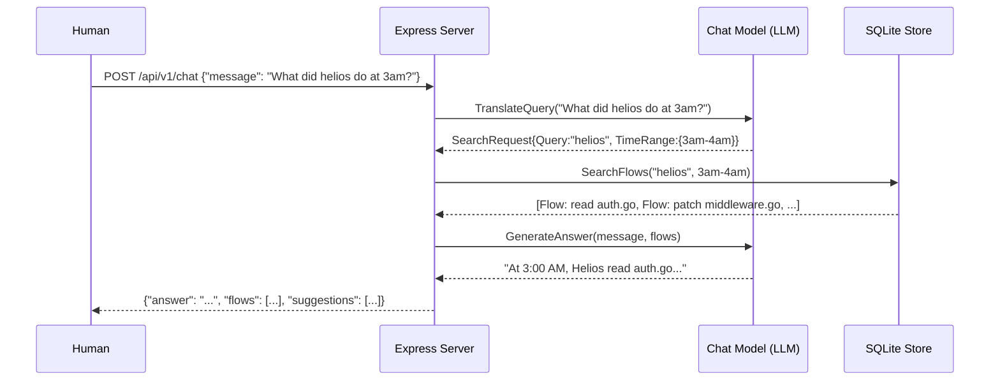

# S04 — Expression Layer

> **"What did helios do at 3am?"** Chat interface as the primary interaction model. Natural language → context windows at decision points. Plus raw traces, dashboards, alerts, and REST API. Agents query Rabbit-Hole to debug other agents.

## 1. Interfaces

```go
// server.go

type ExpressionService interface {
    // Structured search
    Search(ctx context.Context, req SearchRequest) (*SearchResponse, error)

    // Natural language chat
    Chat(ctx context.Context, req ChatRequest) (*ChatResponse, error)

    // CRUD
    GetFlow(ctx context.Context, flowID string) (*Flow, error)
    GetContextWindow(ctx context.Context, flowID string) (*ContextWindow, error)
    GetSession(ctx context.Context, sessionID string) (*Session, error)
    ListSessions(ctx context.Context, opts ListOptions) ([]Session, error)

    // Real-time
    Subscribe(ctx context.Context, sessionID string) (<-chan Flow, error)

    Health(ctx context.Context) error
}

// HTTP Server wrapping the expression service.
type Server struct {
    svc    ExpressionService
    store  Storage
    srv    *http.Server
    mux    *http.ServeMux
    upgrader websocket.Upgrader
    logger *slog.Logger
    // Chat: uses an external LLM (or reuses Gemma) to translate NL → search query
    chatModel ChatModel
}

type ChatModel interface {
    TranslateQuery(ctx context.Context, message string) (*SearchRequest, error)
    GenerateAnswer(ctx context.Context, message string, flows []Flow) (string, error)
}
```

## 2. Implementation

### 2.1 HTTP Server

```go
// server.go

func NewServer(svc ExpressionService, store Storage, logger *slog.Logger, addr string) *Server {
    s := &Server{
        svc:    svc,
        store:  store,
        logger: logger,
        upgrader: websocket.Upgrader{
            CheckOrigin: func(r *http.Request) bool { return true },
        },
    }

    s.mux = http.NewServeMux()

    // Health
    s.mux.HandleFunc("GET /health", s.handleHealth)

    // Sessions
    s.mux.HandleFunc("GET /api/v1/sessions", s.handleListSessions)
    s.mux.HandleFunc("GET /api/v1/sessions/{id}", s.handleGetSession)

    // Flows
    s.mux.HandleFunc("GET /api/v1/flows/{id}", s.handleGetFlow)
    s.mux.HandleFunc("GET /api/v1/flows/{id}/context-window", s.handleGetContextWindow)

    // Search
    s.mux.HandleFunc("POST /api/v1/search", s.handleSearch)

    // Chat
    s.mux.HandleFunc("POST /api/v1/chat", s.handleChat)

    // Real-time WebSocket
    s.mux.HandleFunc("GET /api/v1/ws/sessions/{id}", s.handleWebSocket)

    s.srv = &http.Server{
        Addr:    addr,
        Handler: withMiddleware(s.mux, s.logger),
    }

    return s
}

func (s *Server) Start(ctx context.Context) error {
    s.logger.Info("starting expression server", "addr", s.srv.Addr)
    go func() {
        if err := s.srv.ListenAndServe(); err != nil && err != http.ErrServerClosed {
            s.logger.Error("server error", "err", err)
        }
    }()
    return nil
}

func (s *Server) Shutdown(ctx context.Context) error {
    return s.srv.Shutdown(ctx)
}
```

### 2.2 Chat Handler — Natural Language Query

```go
// chat.go

func (s *Server) handleChat(w http.ResponseWriter, r *http.Request) {
    var req ChatRequest
    if err := json.NewDecoder(r.Body).Decode(&req); err != nil {
        writeError(w, http.StatusBadRequest, "invalid request body: "+err.Error())
        return
    }

    if req.Message == "" {
        writeError(w, http.StatusBadRequest, "message is required")
        return
    }

    ctx := r.Context()

    // Step 1: Translate natural language → structured search
    searchReq, err := s.chatModel.TranslateQuery(ctx, req.Message)
    if err != nil {
        s.logger.Error("query translation failed", "err", err, "message", req.Message)
        writeError(w, http.StatusInternalServerError, "failed to understand query")
        return
    }

    // Step 2: Execute search
    if req.SessionID != "" {
        searchReq.SessionID = req.SessionID
    }
    searchResp, err := s.svc.Search(ctx, *searchReq)
    if err != nil {
        writeError(w, http.StatusInternalServerError, "search failed: "+err.Error())
        return
    }

    // Step 3: Generate natural language answer from results
    answer, err := s.chatModel.GenerateAnswer(ctx, req.Message, searchResp.Flows)
    if err != nil {
        // Fallback: use structured results without NL generation
        answer = formatFallbackAnswer(searchResp)
    }

    // Step 4: Generate follow-up suggestions
    suggestions := s.generateSuggestions(searchResp)

    resp := ChatResponse{
        Answer:      answer,
        Flows:       searchResp.Flows,
        Suggestions: suggestions,
    }

    writeJSON(w, http.StatusOK, resp)
}

// Query translation examples:
//   "What did helios do at 3am?" →
//     SearchRequest{Query: "helios", TimeRange: {Start: "2026-07-12T03:00:00Z", End: "2026-07-12T04:00:00Z"}}
//   "Show me the context window when it decided to patch middleware.go" →
//     SearchRequest{Query: "patch middleware.go", IncludeContextWindows: true}
//   "Is dexdat getting slower?" →
//     SearchRequest{Query: "dexdat", Categories: [Action], sort_by: "duration_desc"}

func (s *Server) generateSuggestions(resp *SearchResponse) []string {
    suggestions := make([]string, 0)

    if resp.Total > len(resp.Flows) {
        suggestions = append(suggestions,
            fmt.Sprintf("Show all %d results", resp.Total))
    }

    if hasFailures(resp.Flows) {
        suggestions = append(suggestions,
            "Why did these failures happen?",
            "Show me context windows for the failures")
    }

    if len(resp.Flows) > 0 && resp.Flows[0].ContextWindow == nil {
        suggestions = append(suggestions,
            "Enable context window capture for future sessions")
    }

    suggestions = append(suggestions,
        "What happened in the last hour?",
        "Show me the slowest operations")

    return suggestions
}
```

### 2.3 Search Handler

```go
// search.go

func (s *Server) handleSearch(w http.ResponseWriter, r *http.Request) {
    var req SearchRequest
    if err := json.NewDecoder(r.Body).Decode(&req); err != nil {
        writeError(w, http.StatusBadRequest, "invalid request body: "+err.Error())
        return
    }

    if req.Limit == 0 {
        req.Limit = 50
    }
    if req.Limit > 500 {
        req.Limit = 500
    }

    ctx, cancel := context.WithTimeout(r.Context(), 30*time.Second)
    defer cancel()

    resp, err := s.svc.Search(ctx, req)
    if err != nil {
        if errors.Is(err, context.DeadlineExceeded) {
            writeError(w, http.StatusGatewayTimeout, "search timed out — try narrowing your query")
            return
        }
        writeError(w, http.StatusInternalServerError, "search failed: "+err.Error())
        return
    }

    writeJSON(w, http.StatusOK, resp)
}
```

### 2.4 WebSocket — Real-Time Flows

```go
// websocket.go

func (s *Server) handleWebSocket(w http.ResponseWriter, r *http.Request) {
    sessionID := r.PathValue("id")

    conn, err := s.upgrader.Upgrade(w, r, nil)
    if err != nil {
        s.logger.Error("websocket upgrade failed", "err", err)
        return
    }
    defer conn.Close()

    ctx, cancel := context.WithCancel(r.Context())
    defer cancel()

    // Subscribe to flow events for this session
    flowCh, err := s.svc.Subscribe(ctx, sessionID)
    if err != nil {
        s.logger.Error("subscribe failed", "err", err, "session", sessionID)
        conn.WriteMessage(websocket.TextMessage, []byte(fmt.Sprintf(
            `{"error":"%s"}`, err.Error())))
        return
    }

    // Set read deadline for ping/pong
    conn.SetReadDeadline(time.Now().Add(60 * time.Second))
    conn.SetPongHandler(func(string) error {
        conn.SetReadDeadline(time.Now().Add(60 * time.Second))
        return nil
    })

    // Write loop: push flows to WebSocket
    ticker := time.NewTicker(30 * time.Second) // ping interval
    defer ticker.Stop()

    for {
        select {
        case flow, ok := <-flowCh:
            if !ok {
                // Channel closed — session ended
                conn.WriteMessage(websocket.CloseMessage,
                    websocket.FormatCloseMessage(websocket.CloseNormalClosure, "session ended"))
                return
            }
            data, _ := json.Marshal(flow)
            conn.SetWriteDeadline(time.Now().Add(10 * time.Second))
            if err := conn.WriteMessage(websocket.TextMessage, data); err != nil {
                return
            }

        case <-ticker.C:
            if err := conn.WriteMessage(websocket.PingMessage, nil); err != nil {
                return
            }

        case <-ctx.Done():
            return
        }
    }
}
```

### 2.5 Middleware

```go
// middleware.go

func withMiddleware(next http.Handler, logger *slog.Logger) http.Handler {
    return http.HandlerFunc(func(w http.ResponseWriter, r *http.Request) {
        start := time.Now()

        // Request ID
        reqID := r.Header.Get("X-Request-ID")
        if reqID == "" {
            reqID = uuid.Must(uuid.NewV7()).String()
        }
        w.Header().Set("X-Request-ID", reqID)

        // CORS
        w.Header().Set("Access-Control-Allow-Origin", "*")
        w.Header().Set("Access-Control-Allow-Methods", "GET, POST, OPTIONS")
        w.Header().Set("Access-Control-Allow-Headers", "Content-Type, X-Request-ID")

        if r.Method == "OPTIONS" {
            w.WriteHeader(http.StatusNoContent)
            return
        }

        // Wrap response writer to capture status code
        rw := &responseWriter{ResponseWriter: w, statusCode: http.StatusOK}

        // Recover from panics
        defer func() {
            if rec := recover(); rec != nil {
                logger.Error("panic in handler",
                    "panic", rec,
                    "method", r.Method,
                    "path", r.URL.Path,
                    "request_id", reqID,
                )
                http.Error(rw, `{"error":"internal server error"}`, http.StatusInternalServerError)
            }
        }()

        next.ServeHTTP(rw, r)

        logger.Info("request",
            "method", r.Method,
            "path", r.URL.Path,
            "status", rw.statusCode,
            "duration", time.Since(start),
            "request_id", reqID,
        )
    })
}

type responseWriter struct {
    http.ResponseWriter
    statusCode int
}

func (rw *responseWriter) WriteHeader(code int) {
    rw.statusCode = code
    rw.ResponseWriter.WriteHeader(code)
}
```

## 3. REST API Contract

### `GET /health`
```
200: {"status":"ok","version":"1.0.0","uptime":"3h24m","sessions_active":12}
```

### `GET /api/v1/sessions?offset=0&limit=20`
```
200: {
  "sessions": [
    {
      "id": "0191a...",
      "agent_pid": 12345,
      "agent_name": "hermes",
      "start_time": "2026-07-12T03:00:00Z",
      "status": "running",
      "flow_count": 847,
      "trace_count": 12405
    }
  ],
  "total": 5,
  "offset": 0,
  "limit": 20
}
```

### `GET /api/v1/sessions/{id}`
```
200: { full Session object with Metadata }
404: {"error":"session not found"}
```

### `GET /api/v1/flows/{id}`
```
200: { full Flow object }
404: {"error":"flow not found"}
```

### `GET /api/v1/flows/{id}/context-window`
```
200: { full ContextWindow object }
404: {"error":"context window not available — may not have been captured"}
```

### `POST /api/v1/search`
```json
// Request
{
  "query": "patch middleware",
  "session_id": "0191a...",
  "time_range": {"start": "2026-07-12T00:00:00Z", "end": "2026-07-12T23:59:59Z"},
  "categories": ["action"],
  "limit": 50,
  "include_context_windows": true
}

// Response
{
  "flows": [...],
  "total": 3,
  "cursor": "0191b...",
  "has_more": false
}
```

### `POST /api/v1/chat`
```json
// Request
{
  "message": "What did helios do at 3am?",
  "session_id": "0191a..."
}

// Response
{
  "answer": "At 3:00 AM, Helios read auth.go (247 lines, took 2ms), then identified a bug in the JWT middleware. It patched middleware.go (12 lines changed) to fix the token validation. The fix passed all tests. Total: 2 file reads, 1 write, 1 test run. All operations successful.",
  "flows": [...],
  "suggestions": [
    "Show me the context window when it patched middleware.go",
    "Why did the JWT middleware need fixing?",
    "What happened in the next hour?"
  ]
}
```

### `GET /api/v1/ws/sessions/{id}` → WebSocket upgrade
```
→ Ping every 30s
→ Flow JSON messages as they're classified
→ Close when session ends
```

## 4. Error Handling

| Error | HTTP Status | Response Body |
|-------|------------|---------------|
| Invalid JSON body | 400 | `{"error":"invalid request body: ..."}` |
| Missing required field | 400 | `{"error":"message is required"}` |
| Session not found | 404 | `{"error":"session not found"}` |
| Flow not found | 404 | `{"error":"flow not found"}` |
| Context window not captured | 404 | `{"error":"context window not available — may not have been captured"}` |
| Search timeout | 504 | `{"error":"search timed out — try narrowing your query"}` |
| Internal error | 500 | `{"error":"internal server error"}` |
| Panic in handler | 500 | `{"error":"internal server error"}` (recovered, logged) |

## 5. Edge Cases

| Edge Case | Behavior |
|-----------|----------|
| Chat query with no results | Return `answer: "I couldn't find any matching activity..."` with empty flows. |
| Chat message is empty string | Return 400. |
| Search with limit=0 | Default to 50. |
| Search with limit > 500 | Cap at 500. |
| WebSocket client disconnects | Channel continues buffering. When buffer fills, oldest flows dropped for that subscriber. |
| Multiple chat requests concurrently | Each gets its own search. No shared state mutation. |
| Chat query mentions a non-existent session | Search filter produces 0 results. Chat responds with "No session matching 'X' found." |
| Very large session (10M+ traces) | Search uses SQLite indexes + pagination. Cursor-based, not offset. |

## 6. Dependencies

```go
import (
    "net/http"
    "encoding/json"
    "github.com/gorilla/websocket"
    "github.com/google/uuid"
    "log/slog"
)
```

**Injected:**
- `ExpressionService` interface (self, for delegation)
- `Storage` interface
- `ChatModel` interface (for NL translation)
- `*slog.Logger`

## 7. Configuration

| Env Var | Type | Default | Description |
|---------|------|---------|-------------|
| `RABBITHOLE_LISTEN_ADDR` | string | `127.0.0.1:9734` | HTTP/WS bind address |
| `RABBITHOLE_READ_TIMEOUT` | duration | `30s` | HTTP read timeout |
| `RABBITHOLE_WRITE_TIMEOUT` | duration | `30s` | HTTP write timeout |
| `RABBITHOLE_WS_PING_INTERVAL` | duration | `30s` | WebSocket ping interval |
| `RABBITHOLE_WS_READ_TIMEOUT` | duration | `60s` | WebSocket read timeout |
| `RABBITHOLE_CORS_ORIGINS` | string | `*` | Allowed CORS origins (comma-separated) |
| `RABBITHOLE_CHAT_ENABLED` | bool | `true` | Enable chat endpoint (requires external LLM) |

## 8. Testing

### Unit Tests
- All handlers: valid request → 200, invalid request → 400, missing resource → 404
- Middleware: request ID generation, CORS headers, panic recovery, logging
- WebSocket: upgrade, flow delivery, ping/pong, client disconnect

### Integration Tests
- Full server lifecycle: start → health check → search → shutdown
- Chat flow: NL message → search translation → results → NL answer
- WebSocket: connect → receive flows → disconnect
- Timeout: search that takes >30s returns 504

### E2E Tests
- `rabbit-hole serve` → `curl localhost:9734/health`
- Attach to a test agent → flows appear in search → chat query references them

## 9. Diagram — Chat Flow



> Next: S05 — Storage & Data Model
