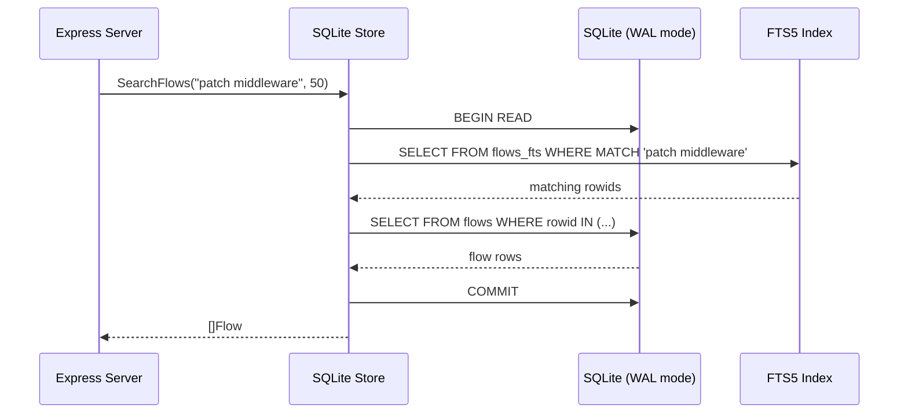

# S05 — Storage & Data Model

> **SQLite with WAL mode, FTS5 for text search, vector extension for semantic search.** Traces, flows, sessions, context windows. Retention policies. One database file — portable, zero-config, self-hosted.

## 1. Interfaces

```go
// storage.go

type Storage interface {
    // Trace operations
    StoreTraces(ctx context.Context, traces []Trace) error
    QueryTraces(ctx context.Context, req TraceQuery) ([]Trace, error)

    // Flow operations
    StoreFlows(ctx context.Context, flows []Flow) error
    GetFlow(ctx context.Context, flowID string) (*Flow, error)
    QueryFlows(ctx context.Context, req FlowQuery) ([]Flow, string, error) // returns cursor

    // Session operations
    StoreSession(ctx context.Context, session *Session) error
    GetSession(ctx context.Context, sessionID string) (*Session, error)
    ListSessions(ctx context.Context, offset, limit int) ([]Session, error)
    UpdateSession(ctx context.Context, session *Session) error

    // Context window operations
    StoreContextWindow(ctx context.Context, cw *ContextWindow) error
    GetContextWindow(ctx context.Context, flowID string) (*ContextWindow, error)

    // Search
    SearchFlows(ctx context.Context, query string, limit int) ([]Flow, error)

    // Maintenance
    Compact(ctx context.Context, before time.Time) error
    Stats(ctx context.Context) (StorageStats, error)
    Health(ctx context.Context) error
}

type TraceQuery struct {
    SessionID string
    Category  TraceCategory
    TimeRange TimeRange
    Syscall   string
    Limit     int
}

type FlowQuery struct {
    SessionID              string
    Query                  string // FTS5 or semantic
    TimeRange              TimeRange
    Phases                 []FlowPhase
    Outcomes               []FlowOutcome
    MinConfidence          float64
    IncludeContextWindows  bool
    SortBy                 string // "timestamp", "duration_desc", "confidence_desc"
    Limit                  int
    Cursor                 string
}

type StorageStats struct {
    TotalTraces   int64
    TotalFlows    int64
    TotalSessions int64
    DBSizeBytes   int64
    WALSizeBytes  int64
    OldestTrace   time.Time
    NewestTrace   time.Time
}

type TimeRange struct {
    Start time.Time
    End   time.Time
}
```

## 2. Exact DDL

```sql
-- migrations/001_initial.up.sql

PRAGMA journal_mode=WAL;
PRAGMA foreign_keys=ON;
PRAGMA busy_timeout=5000;

-- ============================================================
-- SESSIONS
-- ============================================================
CREATE TABLE sessions (
    id          TEXT PRIMARY KEY,         -- UUIDv7
    agent_pid   INTEGER NOT NULL,
    agent_name  TEXT NOT NULL,
    start_time  TEXT NOT NULL,            -- ISO 8601
    end_time    TEXT,                     -- NULL while running
    status      TEXT NOT NULL DEFAULT 'running',  -- running, completed, crashed, killed
    command_line TEXT NOT NULL DEFAULT '',
    work_dir    TEXT NOT NULL DEFAULT '',
    binary_path TEXT NOT NULL DEFAULT '',
    env_vars    TEXT NOT NULL DEFAULT '{}', -- JSON object
    version     TEXT NOT NULL DEFAULT '',
    trace_count INTEGER NOT NULL DEFAULT 0,
    flow_count  INTEGER NOT NULL DEFAULT 0,
    created_at  TEXT NOT NULL DEFAULT (datetime('now')),
    updated_at  TEXT NOT NULL DEFAULT (datetime('now'))
);

CREATE INDEX idx_sessions_status ON sessions(status);
CREATE INDEX idx_sessions_agent_pid ON sessions(agent_pid);
CREATE INDEX idx_sessions_start_time ON sessions(start_time);

-- ============================================================
-- TRACES
-- ============================================================
CREATE TABLE traces (
    id          TEXT PRIMARY KEY,         -- UUIDv7
    session_id  TEXT NOT NULL REFERENCES sessions(id) ON DELETE CASCADE,
    timestamp   TEXT NOT NULL,            -- ISO 8601 with ns precision
    category    TEXT NOT NULL,            -- syscall, network, file, llm_call, context_window, process, resource
    syscall     TEXT NOT NULL DEFAULT '',
    args        TEXT NOT NULL DEFAULT '[]', -- JSON array
    return_value INTEGER NOT NULL DEFAULT 0,
    duration_ns INTEGER NOT NULL DEFAULT 0,
    errno       INTEGER NOT NULL DEFAULT 0,
    stack       TEXT NOT NULL DEFAULT '[]', -- JSON array of frame addresses
    filename    TEXT NOT NULL DEFAULT '',
    saddr       TEXT NOT NULL DEFAULT '',   -- source IP (IPv4 string)
    daddr       TEXT NOT NULL DEFAULT '',   -- dest IP
    sport       INTEGER NOT NULL DEFAULT 0,
    dport       INTEGER NOT NULL DEFAULT 0
);

CREATE INDEX idx_traces_session_id ON traces(session_id);
CREATE INDEX idx_traces_session_time ON traces(session_id, timestamp);
CREATE INDEX idx_traces_category ON traces(category);
CREATE INDEX idx_traces_syscall ON traces(syscall);
CREATE INDEX idx_traces_timestamp ON traces(timestamp);

-- Partition by date for efficient retention deletion
-- We use a generated column so retention can delete by date range
-- NOTE: timestamptz → date requires AT TIME ZONE for immutability in PostgreSQL,
-- but SQLite doesn't enforce this. timestamp is stored as ISO 8601 text.
-- For SQLite, we extract date directly from the text column.
CREATE INDEX idx_traces_date ON traces(date(timestamp));

-- ============================================================
-- FLOWS
-- ============================================================
CREATE TABLE flows (
    id          TEXT PRIMARY KEY,         -- UUIDv7
    session_id  TEXT NOT NULL REFERENCES sessions(id) ON DELETE CASCADE,
    trace_ids   TEXT NOT NULL DEFAULT '[]', -- JSON array of trace IDs

    -- Classification results
    intent      TEXT NOT NULL DEFAULT 'unknown',
    phase       TEXT NOT NULL DEFAULT 'action',
    description TEXT NOT NULL DEFAULT '',
    outcome     TEXT NOT NULL DEFAULT 'unknown',
    confidence  REAL NOT NULL DEFAULT 0.0,

    -- Timing
    start_time  TEXT NOT NULL,
    end_time    TEXT NOT NULL,
    duration_ns INTEGER NOT NULL DEFAULT 0,

    -- Classification metadata (JSON — layer-specific)
    metadata    TEXT NOT NULL DEFAULT '{}',

    created_at  TEXT NOT NULL DEFAULT (datetime('now'))
);

CREATE INDEX idx_flows_session_id ON flows(session_id);
CREATE INDEX idx_flows_session_time ON flows(session_id, start_time);
CREATE INDEX idx_flows_intent ON flows(intent);
CREATE INDEX idx_flows_phase ON flows(phase);
CREATE INDEX idx_flows_outcome ON flows(outcome);
CREATE INDEX idx_flows_confidence ON flows(confidence);
CREATE INDEX idx_flows_start_time ON flows(start_time);
CREATE INDEX idx_flows_date ON flows(date(start_time));

-- FTS5 for full-text search on flow descriptions
CREATE VIRTUAL TABLE flows_fts USING fts5(
    intent,
    description,
    outcome,
    content='flows',
    content_rowid='rowid'
);

-- Triggers to keep FTS5 in sync
CREATE TRIGGER flows_ai AFTER INSERT ON flows BEGIN
    INSERT INTO flows_fts(rowid, intent, description, outcome)
    VALUES (new.rowid, new.intent, new.description, new.outcome);
END;

CREATE TRIGGER flows_ad AFTER DELETE ON flows BEGIN
    INSERT INTO flows_fts(flows_fts, rowid, intent, description, outcome)
    VALUES ('delete', old.rowid, old.intent, old.description, old.outcome);
END;

CREATE TRIGGER flows_au AFTER UPDATE ON flows BEGIN
    INSERT INTO flows_fts(flows_fts, rowid, intent, description, outcome)
    VALUES ('delete', old.rowid, old.intent, old.description, old.outcome);
    INSERT INTO flows_fts(rowid, intent, description, outcome)
    VALUES (new.rowid, new.intent, new.description, new.outcome);
END;

-- ============================================================
-- CONTEXT WINDOWS
-- ============================================================
CREATE TABLE context_windows (
    flow_id         TEXT PRIMARY KEY REFERENCES flows(id) ON DELETE CASCADE,
    timestamp       TEXT NOT NULL,
    model_name      TEXT NOT NULL DEFAULT '',
    prompt_text     TEXT NOT NULL DEFAULT '',
    messages_in     TEXT NOT NULL DEFAULT '',
    messages_out    TEXT NOT NULL DEFAULT '',
    token_count     INTEGER NOT NULL DEFAULT 0,
    duration_ns     INTEGER NOT NULL DEFAULT 0
);

CREATE INDEX idx_context_windows_timestamp ON context_windows(timestamp);

-- ============================================================
-- METADATA / CONFIG
-- ============================================================
CREATE TABLE metadata (
    key   TEXT PRIMARY KEY,
    value TEXT NOT NULL
);

-- Schema version for migration tracking
INSERT INTO metadata (key, value) VALUES ('schema_version', '1');
```

## 3. Implementation

### 3.1 SQLite Store

```go
// sqlite.go

type SQLiteStore struct {
    db     *sql.DB
    logger *slog.Logger
}

func NewSQLiteStore(dbPath string, logger *slog.Logger) (*SQLiteStore, error) {
    db, err := sql.Open("sqlite3", dbPath+"?_journal_mode=WAL&_foreign_keys=on&_busy_timeout=5000")
    if err != nil {
        return nil, fmt.Errorf("open sqlite: %w", err)
    }

    // Connection pool: SQLite is single-writer, so max 1 connection
    // but allow multiple readers via WAL mode
    db.SetMaxOpenConns(1)
    db.SetMaxIdleConns(1)

    store := &SQLiteStore{db: db, logger: logger}

    if err := store.migrate(context.Background()); err != nil {
        db.Close()
        return nil, fmt.Errorf("migrate: %w", err)
    }

    return store, nil
}

func (s *SQLiteStore) Close() error {
    return s.db.Close()
}
```

### 3.2 Flow Storage with FTS5

```go
func (s *SQLiteStore) StoreFlows(ctx context.Context, flows []Flow) error {
    tx, err := s.db.BeginTx(ctx, nil)
    if err != nil {
        return fmt.Errorf("begin tx: %w", err)
    }
    defer tx.Rollback()

    stmt, err := tx.PrepareContext(ctx, `
        INSERT INTO flows (id, session_id, trace_ids, intent, phase, description, 
                           outcome, confidence, start_time, end_time, duration_ns, metadata)
        VALUES (?, ?, ?, ?, ?, ?, ?, ?, ?, ?, ?, ?)
    `)
    if err != nil {
        return fmt.Errorf("prepare: %w", err)
    }
    defer stmt.Close()

    for _, flow := range flows {
        traceIDsJSON, _ := json.Marshal(flow.TraceIDs)
        metadataJSON, _ := json.Marshal(flow.Metadata)

        _, err := stmt.ExecContext(ctx,
            flow.ID, flow.SessionID, string(traceIDsJSON),
            flow.Intent, flow.Phase, flow.Description,
            flow.Outcome, flow.Confidence,
            flow.StartTime.Format(time.RFC3339Nano),
            flow.EndTime.Format(time.RFC3339Nano),
            flow.Duration.Nanoseconds(),
            string(metadataJSON),
        )
        if err != nil {
            return fmt.Errorf("insert flow %s: %w", flow.ID, err)
        }
    }

    return tx.Commit()
}
```

### 3.3 SearchFlows — FTS5 + Structured Query

```go
func (s *SQLiteStore) SearchFlows(ctx context.Context, query string, limit int) ([]Flow, error) {
    // Try FTS5 first
    if query != "" {
        rows, err := s.db.QueryContext(ctx, `
            SELECT f.id, f.session_id, f.trace_ids, f.intent, f.phase, f.description,
                   f.outcome, f.confidence, f.start_time, f.end_time, f.duration_ns, f.metadata
            FROM flows f
            JOIN flows_fts ft ON f.rowid = ft.rowid
            WHERE flows_fts MATCH ?
            ORDER BY rank
            LIMIT ?
        `, query, limit)
        if err != nil {
            // FTS5 may fail for malformed queries — fall back to LIKE
            return s.searchFlowsLike(ctx, query, limit)
        }
        defer rows.Close()
        return scanFlows(rows)
    }

    // No query — return most recent
    return s.searchFlowsRecent(ctx, limit)
}

func (s *SQLiteStore) searchFlowsLike(ctx context.Context, query string, limit int) ([]Flow, error) {
    rows, err := s.db.QueryContext(ctx, `
        SELECT id, session_id, trace_ids, intent, phase, description,
               outcome, confidence, start_time, end_time, duration_ns, metadata
        FROM flows
        WHERE description LIKE ? OR intent LIKE ?
        ORDER BY start_time DESC
        LIMIT ?
    `, "%"+query+"%", "%"+query+"%", limit)
    if err != nil {
        return nil, err
    }
    defer rows.Close()
    return scanFlows(rows)
}
```

### 3.4 Compact — Retention

```go
func (s *SQLiteStore) Compact(ctx context.Context, before time.Time) error {
    s.logger.Info("starting compaction", "before", before)

    // Delete old traces
    result, err := s.db.ExecContext(ctx,
        `DELETE FROM traces WHERE timestamp < ?`, before.Format(time.RFC3339Nano))
    if err != nil {
        return fmt.Errorf("delete old traces: %w", err)
    }
    deleted, _ := result.RowsAffected()
    s.logger.Info("deleted old traces", "count", deleted)

    // Delete old flows (cascades to context_windows)
    result, err = s.db.ExecContext(ctx,
        `DELETE FROM flows WHERE start_time < ?`, before.Format(time.RFC3339Nano))
    if err != nil {
        return fmt.Errorf("delete old flows: %w", err)
    }
    deleted, _ = result.RowsAffected()
    s.logger.Info("deleted old flows", "count", deleted)

    // Delete old sessions with no remaining flows
    _, err = s.db.ExecContext(ctx, `
        DELETE FROM sessions
        WHERE end_time < ? AND end_time IS NOT NULL
        AND id NOT IN (SELECT DISTINCT session_id FROM flows)
    `, before.Format(time.RFC3339Nano))
    if err != nil {
        return fmt.Errorf("delete orphan sessions: %w", err)
    }

    // Reclaim space
    _, err = s.db.ExecContext(ctx, `VACUUM`)
    if err != nil {
        s.logger.Warn("vacuum failed", "err", err)
        // non-fatal — data is deleted, space will be reused eventually
    }

    return nil
}
```

## 4. Error Handling

| Error | Condition | Behavior |
|-------|-----------|----------|
| `SQLITE_BUSY` | WAL checkpoint in progress | Retry 3x with exponential backoff (10ms, 100ms, 1s). On final failure, return 503. |
| `SQLITE_CORRUPT` | Database file corruption | Return error. Health check fails. Operator must restore from backup or run `sqlite3 db ".recover"`. |
| `SQLITE_FULL` | Disk full | Return error. Log critical. Compact immediately. |
| `SQLITE_CONSTRAINT` | FK violation (orphan trace referencing deleted session) | Log warning, skip the offending row. Don't fail the batch. |
| FTS5 query parse error | Malformed search query | Fall back to LIKE-based search. |

## 5. Edge Cases

| Edge Case | Behavior |
|-----------|----------|
| Concurrent writes from classifier + expression server | SQLite WAL mode handles concurrent readers. Single writer serializes writes. Busy timeout prevents `SQLITE_BUSY`. |
| Very large batch (10K traces) | Batch insert in a single transaction. If OOM, chunk into 1K-trace transactions. |
| Trace with NULL context window | `context_windows` row simply doesn't exist. `GetContextWindow` returns `ErrContextWindowNotFound`. |
| Session deleted while flows still reference it | FK constraint `ON DELETE CASCADE` — flows and context windows deleted automatically. |
| FTS5 index out of sync with flows table | Rebuild with `INSERT INTO flows_fts(flows_fts) VALUES('rebuild')`. |
| Database file grows to 100GB+ | Compaction deletes old data. VACUUM reclaims space. Monitor `DBSizeBytes` in Stats(). |
| Migration from schema v1 to v2 | Read `metadata.schema_version`. Run migration SQL for each version gap. WAL mode ensures atomicity. |

## 6. Dependencies

```go
import (
    "database/sql"
    "encoding/json"
    "fmt"
    "time"
    _ "github.com/mattn/go-sqlite3" // SQLite driver with FTS5 + JSON support
)
```

**Injected:**
- `*slog.Logger`

**Injected into:**
- Classification Engine (stores flows)
- Expression Layer (reads flows, sessions)

## 7. Configuration

| Env Var | Type | Default | Description |
|---------|------|---------|-------------|
| `RABBITHOLE_DATA_DIR` | string | `~/.rabbit-hole/` | Data directory |
| `RABBITHOLE_DB_PATH` | string | `$DATA_DIR/rabbit-hole.db` | SQLite database path |
| `RABBITHOLE_RETENTION_DAYS` | int | `30` | Auto-delete data older than N days |
| `RABBITHOLE_COMPACT_INTERVAL` | duration | `1h` | Compaction interval |

SQLite connection string is constructed as:
```
<path>?_journal_mode=WAL&_foreign_keys=on&_busy_timeout=5000
```

## 8. Migration System

```go
// migrate.go

func (s *SQLiteStore) migrate(ctx context.Context) error {
    // Ensure metadata table exists
    _, err := s.db.ExecContext(ctx, `
        CREATE TABLE IF NOT EXISTS metadata (
            key TEXT PRIMARY KEY,
            value TEXT NOT NULL
        )
    `)
    if err != nil {
        return fmt.Errorf("create metadata table: %w", err)
    }

    // Get current schema version
    var version int
    err = s.db.QueryRowContext(ctx,
        `SELECT CAST(value AS INTEGER) FROM metadata WHERE key = 'schema_version'`,
    ).Scan(&version)
    if err != nil {
        version = 0 // no version — fresh database
    }

    // Apply migrations in order
    migrations := []struct {
        version int
        sql     string
    }{
        {1, migration001},
    }

    for _, m := range migrations {
        if m.version > version {
            s.logger.Info("applying migration", "version", m.version)
            if _, err := s.db.ExecContext(ctx, m.sql); err != nil {
                return fmt.Errorf("migration %d: %w", m.version, err)
            }
            _, err = s.db.ExecContext(ctx,
                `INSERT OR REPLACE INTO metadata (key, value) VALUES ('schema_version', ?)`,
                m.version,
            )
            if err != nil {
                return fmt.Errorf("update schema_version: %w", err)
            }
        }
    }

    return nil
}
```

## 9. Testing

### Unit Tests
- SQLite store using `:memory:` → verify all CRUD operations
- Transaction rollback on error: invalid flow → verify no partial writes
- FTS5 search: exact match, partial match, no match
- Retention: insert old data → compact → verify deleted
- Migration: start at v0 → verify v1 schema created

### Integration Tests
- Concurrent read/write: 10 goroutines reading while 1 writes → no SQLITE_BUSY
- Large batch: 10K traces in one StoreTraces call → all stored, no OOM
- FTS5 rebuild: corrupt index → rebuild → verify search works again

### Stress Tests
- 1M trace inserts → verify < 30s
- 100 concurrent FTS5 searches → verify < 50ms per search
- Compact on 1M rows → verify < 60s

## 10. Diagram — Query Flow



> Next: S06 — CLI & Self-Hosted Deployment
