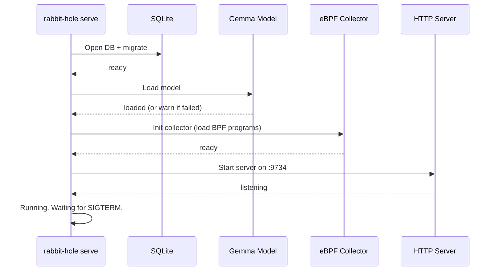

# S06 — CLI & Self-Hosted Deployment

> **One binary.** `rabbit-hole attach --pid <PID>`, `rabbit-hole serve`, `rabbit-hole chat "what did helios do?"`. Self-hosted first. No cloud dependency.

## 1. CLI Commands

```go
// cmd/rabbit-hole/main.go

func main() {
    rootCmd := &cobra.Command{
        Use:   "rabbit-hole",
        Short: "Go down the rabbit hole into your agent's decisions",
        Long: `Rabbit-Hole attaches to agent processes and makes their decision-making
legible. Three layers: collect (eBPF), classify (local Gemma), express (chat).

Self-hosted. One binary. Zero SDK.`,
    }

    rootCmd.AddCommand(
        newAttachCmd(),
        newDetachCmd(),
        newListCmd(),
        newServeCmd(),
        newChatCmd(),
        newSearchCmd(),
        newCompactCmd(),
        newStatusCmd(),
        newVersionCmd(),
    )

    rootCmd.Execute()
}
```

### 1.1 `rabbit-hole attach`

```bash
# Attach to a running agent by PID
rabbit-hole attach --pid 12345

# With context window capture (expensive)
rabbit-hole attach --pid 12345 --context-windows

# Only trace file and network operations
rabbit-hole attach --pid 12345 --categories file,network

# Disable TLS interception
rabbit-hole attach --pid 12345 --no-tls-intercept

# Follow children (forks)
rabbit-hole attach --pid 12345 --follow-children
```

```go
func newAttachCmd() *cobra.Command {
    var (
        pid             int32
        contextWindows  bool
        categories      []string
        noTLSIntercept  bool
        followChildren  bool
    )

    cmd := &cobra.Command{
        Use:   "attach --pid <PID>",
        Short: "Attach to an agent process and start collecting traces",
        Args:  cobra.NoArgs,
        RunE: func(cmd *cobra.Command, args []string) error {
            cfg := loadConfig()

            collector, err := collector.NewEBPFCollector(cfg, slog.Default())
            if err != nil {
                return fmt.Errorf("init collector: %w", err)
            }

            var cats []types.TraceCategory
            if len(categories) > 0 {
                for _, c := range categories {
                    cats = append(cats, types.TraceCategory(c))
                }
            }

            session, err := collector.Attach(cmd.Context(), pid, types.CollectOptions{
                ContextWindows:  contextWindows,
                TraceCategories: cats,
                TLSInterception:  !noTLSIntercept,
                FollowChildren:   followChildren,
            })
            if err != nil {
                return err
            }

            fmt.Printf("Attached to PID %d\n", pid)
            fmt.Printf("Session ID: %s\n", session.ID)
            fmt.Printf("Agent: %s (%s)\n", session.AgentName, session.Metadata.CommandLine)
            fmt.Println()
            fmt.Println("Collection active. Use 'rabbit-hole status' to monitor or 'rabbit-hole chat' to query.")
            fmt.Printf("Detach with: rabbit-hole detach %s\n", session.ID)

            return nil
        },
    }

    cmd.Flags().Int32Var(&pid, "pid", 0, "Agent process ID to attach to")
    cmd.Flags().BoolVar(&contextWindows, "context-windows", false, "Enable context window capture (expensive)")
    cmd.Flags().StringSliceVar(&categories, "categories", nil, "Trace categories to collect (syscall,network,file,llm_call,process,resource)")
    cmd.Flags().BoolVar(&noTLSIntercept, "no-tls-intercept", false, "Disable TLS interception")
    cmd.Flags().BoolVar(&followChildren, "follow-children", false, "Also trace child processes")
    cmd.MarkFlagRequired("pid")

    return cmd
}
```

### 1.2 `rabbit-hole detach`

```bash
rabbit-hole detach <session-id>
rabbit-hole detach --all  # detach all sessions
```

### 1.3 `rabbit-hole list`

```bash
rabbit-hole list            # active sessions
rabbit-hole list --all      # all sessions including completed
rabbit-hole list --status crashed  # filter by status
```

Output:
```
SESSIONS (2 active)

ID          PID    AGENT     STATUS    TRACES   FLOWS   STARTED
0191abc...  12345  hermes    running   12,405   847     2026-07-12 03:00:00
0191def...  12346  codex     running   1,203    89      2026-07-12 04:15:00
```

### 1.4 `rabbit-hole serve`

```bash
rabbit-hole serve                        # default: 127.0.0.1:9734
rabbit-hole serve --addr 0.0.0.0:9734   # expose to network
rabbit-hole serve --no-classifier        # classification disabled (pattern match only)
```

Starts the daemon:
1. Opens SQLite database
2. Loads Gemma model (if available)
3. Starts eBPF collector
4. Starts classification engine
5. Starts HTTP/WebSocket server
6. Blocks until SIGINT/SIGTERM

```go
func newServeCmd() *cobra.Command {
    var (
        addr         string
        noClassifier bool
    )

    cmd := &cobra.Command{
        Use:   "serve",
        Short: "Start the Rabbit-Hole daemon (collect + classify + serve)",
        RunE: func(cmd *cobra.Command, args []string) error {
            cfg := loadConfig()
            if addr != "" {
                cfg.ListenAddr = addr
            }

            logger := slog.New(slog.NewTextHandler(os.Stderr, &slog.HandlerOptions{
                Level: cfg.logLevel(),
            }))

            // 1. Storage
            store, err := storage.NewSQLiteStore(cfg.dbPath(), logger)
            if err != nil {
                return fmt.Errorf("storage: %w", err)
            }
            defer store.Close()

            // 2. Collector
            collector, err := collector.NewEBPFCollector(cfg, logger)
            if err != nil {
                return fmt.Errorf("collector: %w", err)
            }

            // 3. Classifier
            var classifier classify.Classifier
            if !noClassifier {
                model := classify.NewGemmaModel(cfg.ModelPath, cfg.ModelName)
                if err := model.Load(cmd.Context()); err != nil {
                    logger.Warn("failed to load classification model — pattern matching only", "err", err)
                } else {
                    defer model.Unload()
                }
                classifier = classify.NewClassificationEngine(model, store, logger)
            }

            // 4. Pipeline: collector → classifier → store
            go runPipeline(cmd.Context(), collector, classifier, store, logger)

            // 5. Expression server
            server := express.NewServer(store, logger, cfg.ListenAddr)
            if err := server.Start(cmd.Context()); err != nil {
                return fmt.Errorf("server: %w", err)
            }

            logger.Info("rabbit-hole is running", "addr", cfg.ListenAddr, "pid", os.Getpid())

            // Wait for signal
            sigCh := make(chan os.Signal, 1)
            signal.Notify(sigCh, syscall.SIGINT, syscall.SIGTERM)
            <-sigCh

            logger.Info("shutting down...")
            server.Shutdown(context.Background())
            return nil
        },
    }

    cmd.Flags().StringVar(&addr, "addr", "", "Listen address (default: 127.0.0.1:9734)")
    cmd.Flags().BoolVar(&noClassifier, "no-classifier", false, "Disable classification (pattern matching only)")

    return cmd
}
```

### 1.5 `rabbit-hole chat`

```bash
# One-shot chat query
rabbit-hole chat "What did helios do at 3am?"

# Query with session filter
rabbit-hole chat --session 0191abc "What files did it write?"

# Output format
rabbit-hole chat "show me failures" --json     # structured output
rabbit-hole chat "is dexdat getting slower?"    # natural language
```

Output:
```
🤖 At 3:00 AM, Helios read auth.go (247 lines, took 2ms), then identified
a bug in the JWT middleware. It patched middleware.go (12 lines changed)
to fix the token validation. The fix passed all tests.

Total: 2 file reads, 1 write, 1 test run. All operations successful.

📌 Follow-up questions:
  • Show me the context window when it patched middleware.go
  • Why did the JWT middleware need fixing?
  • What happened in the next hour?
```

### 1.6 `rabbit-hole search`

```bash
rabbit-hole search "patch middleware"                    # FTS5 text search
rabbit-hole search --intent write_file                   # filter by intent
rabbit-hole search --phase action --outcome failure      # find failures
rabbit-hole search --session 0191abc --since 1h          # recent in session
rabbit-hole search --confidence 0.8                      # high confidence only
rabbit-hole search --json --limit 100                    # structured output
```

### 1.7 `rabbit-hole compact`

```bash
rabbit-hole compact                          # compact now (default 30-day retention)
rabbit-hole compact --before 2026-06-01      # delete data before date
rabbit-hole compact --retention 7d           # delete older than 7 days
```

### 1.8 `rabbit-hole status`

```bash
rabbit-hole status
```

Output:
```
Rabbit-Hole v1.0.0

Database: ~/.rabbit-hole/rabbit-hole.db (2.3 GB)
Sessions: 5 (2 active, 3 completed)
Traces: 145,203
Flows: 12,847
Oldest data: 2026-06-12 03:00:00 (30 days ago)
Model: gemma-3-4b (loaded, 1,203 inferences)
Server: 127.0.0.1:9734 (running)
Uptime: 3h 24m
```

### 1.9 `rabbit-hole version`

```bash
rabbit-hole version
# rabbit-hole v1.0.0 (linux/amd64)
# build: 2026-07-12_03:00:00
# commit: abc123
```

## 2. Systemd Unit

```ini
# /etc/systemd/system/rabbit-hole.service
[Unit]
Description=Rabbit-Hole Agent Legibility
After=network-online.target
Wants=network-online.target

[Service]
Type=simple
ExecStart=/usr/local/bin/rabbit-hole serve
Restart=always
RestartSec=10
User=rabbit-hole

# Required for eBPF
CapabilityBoundingSet=CAP_BPF CAP_SYS_ADMIN CAP_NET_ADMIN
AmbientCapabilities=CAP_BPF CAP_SYS_ADMIN CAP_NET_ADMIN

# Resource limits
LimitNOFILE=65536
LimitMEMLOCK=infinity
MemoryMax=4G

# Environment
Environment=RABBITHOLE_DATA_DIR=/var/lib/rabbit-hole
Environment=RABBITHOLE_LISTEN_ADDR=127.0.0.1:9734
Environment=RABBITHOLE_RETENTION_DAYS=30

[Install]
WantedBy=multi-user.target
```

## 3. Install Script

```bash
#!/bin/bash
# install.sh — one-command install for Rabbit-Hole
set -euo pipefail

INSTALL_DIR="${RABBITHOLE_INSTALL_DIR:-/usr/local/bin}"
DATA_DIR="${RABBITHOLE_DATA_DIR:-$HOME/.rabbit-hole}"
VERSION="${RABBITHOLE_VERSION:-latest}"

echo "🐇 Installing Rabbit-Hole v${VERSION}..."

# 1. Download binary
ARCH=$(uname -m)
case "$ARCH" in
    x86_64)  GOARCH="amd64" ;;
    aarch64) GOARCH="arm64" ;;
    *) echo "Unsupported architecture: $ARCH"; exit 1 ;;
esac

BINARY_URL="https://gitlab.readydedis.com/rabbit-hole/rabbit-hole/-/releases/v${VERSION}/downloads/rabbit-hole_${VERSION}_linux_${GOARCH}.tar.gz"

curl -sSL "$BINARY_URL" | tar xz -C "$INSTALL_DIR" rabbit-hole
chmod +x "$INSTALL_DIR/rabbit-hole"

# 2. Create data directory
mkdir -p "$DATA_DIR"/{models,logs}

# 3. Download Gemma model (optional — skip if model already exists)
MODEL_PATH="$DATA_DIR/models/gemma-3-4b.gguf"
if [ ! -f "$MODEL_PATH" ]; then
    echo "Downloading Gemma 3 4B model (optional — press Ctrl+C to skip)..."
    curl -sSL "https://huggingface.co/google/gemma-3-4b-gguf/resolve/main/gemma-3-4b-Q4_K_M.gguf" \
        -o "$MODEL_PATH" || echo "Model download skipped. Classification with model will be unavailable."
fi

# 4. Install systemd service (optional)
if [ "${RABBITHOLE_NO_SYSTEMD:-}" != "1" ] && command -v systemctl &>/dev/null; then
    echo "Installing systemd service..."
    sudo tee /etc/systemd/system/rabbit-hole.service > /dev/null <<'SYSTEMD'
[Unit]
Description=Rabbit-Hole Agent Legibility
After=network-online.target

[Service]
Type=simple
ExecStart=/usr/local/bin/rabbit-hole serve
Restart=always
RestartSec=10
User=%u
CapabilityBoundingSet=CAP_BPF CAP_SYS_ADMIN CAP_NET_ADMIN
AmbientCapabilities=CAP_BPF CAP_SYS_ADMIN CAP_NET_ADMIN
LimitNOFILE=65536
LimitMEMLOCK=infinity
MemoryMax=4G
Environment=RABBITHOLE_DATA_DIR=%h/.rabbit-hole
Environment=RABBITHOLE_LISTEN_ADDR=127.0.0.1:9734

[Install]
WantedBy=multi-user.target
SYSTEMD
    sudo systemctl daemon-reload
    sudo systemctl enable --now rabbit-hole
    echo "✓ Rabbit-Hole is running! Chat with it: rabbit-hole chat 'what happened?'"
else
    echo "✓ Rabbit-Hole installed!"
    echo "  Start daemon:  rabbit-hole serve"
    echo "  Attach to PID: rabbit-hole attach --pid <PID>"
    echo "  Chat:           rabbit-hole chat 'what did my agent do?'"
fi
```

## 4. Configuration

| Env Var | Type | Default | Description |
|---------|------|---------|-------------|
| `RABBITHOLE_DATA_DIR` | string | `~/.rabbit-hole/` | Data directory |
| `RABBITHOLE_MODEL_PATH` | string | `$DATA_DIR/models/gemma-3-4b.gguf` | Gemma GGUF path |
| `RABBITHOLE_MODEL_NAME` | string | `gemma-3-4b` | Model identifier |
| `RABBITHOLE_LISTEN_ADDR` | string | `127.0.0.1:9734` | HTTP bind address |
| `RABBITHOLE_BUFFER_SIZE` | int | `100000` | Ring buffer size |
| `RABBITHOLE_BATCH_INTERVAL` | duration | `500ms` | Classification batch interval |
| `RABBITHOLE_RETENTION_DAYS` | int | `30` | Data retention |
| `RABBITHOLE_MAX_SESSIONS` | int | `50` | Max concurrent sessions |
| `RABBITHOLE_LOG_LEVEL` | string | `info` | Log level |
| `RABBITHOLE_TLS_INTERCEPT` | bool | `true` | TLS interception |

## 5. Testing

### Unit Tests
- Each command: valid flags, missing required flags, help text
- Config loading: env vars, defaults, validation

### Integration Tests
- `rabbit-hole version` → prints version
- `rabbit-hole serve` → starts, responds to health check, clean shutdown on SIGTERM
- `rabbit-hole attach --pid <sleep 5>` → creates session, detaches on process exit
- `rabbit-hole chat "show me sessions"` → returns session list in chat format
- `rabbit-hole search "read"` → returns matching flows

### E2E
- Full flow: serve → attach to test-agent → chat query → verify results → detach

## 6. Diagram — Startup Sequence



> Next: Task Board (`.coding-hermes/tasks.md`)
